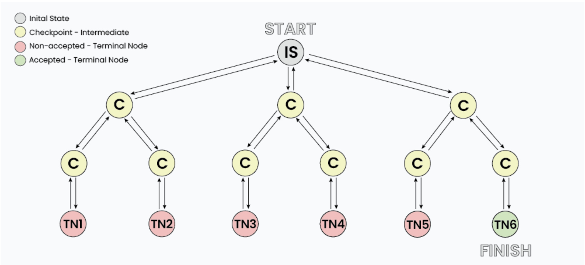

# Backtracking

<details>
<summary>Backtracking definitions</summary>

1. Backtracking is an algorithm approach for finding all the possible solutions by exploring all possible ways.

2. Backtracking is like trying different paths, and when you hit a dead end, you backtrack to the last choice and try a different route. (Dead end means: one of the found solutions turns out to not satisfy the given criteria, so it discards the solution and makes some changes and backtracks again.)

3. Backtracking is a problem-solving algorithmic technique that involves finding a solution incrementally by trying different options and undoing them if they lead to a dead end. When a dead end is reached, the algorithm backtracks to the previous decision point and explores a different path until a solution is found or all possibilities have been exhausted.

</details>

<details>
<summary>Why is it used?</summary>

1. Commonly used in situations where you need to explore multiple possibilities to solve a problem, like searching for a path in a maze or solving puzzles like Sudoku.

</details>

<details>
<summary>Terminologies</summary>

1. Candidate
2. Solution
3. Partial Solution
4. Decision Space
5. Decision Point
6. Feasible Solution
7. Dead End
8. Backtrack
9. Search Space
10. Optimal Solution

</details>

<details>
<summary>Types of Backtracking problems</summary>

1. Decision Problems: We search for a feasible solution.
2. Optimization Problems: We search for the best solution.
3. Enumeration Problems: We find a set of all possible feasible solutions to the problem.

</details>

<details>
<summary>How does it work?</summary>


- "IS" represents the Initial State where the recursion call starts to find a valid solution.
- "C" represents different Checkpoints for recursive calls.
- "TN" represents Terminal Nodes where no further recursive calls can be made, these nodes act as base case of recursion and we determine whether the current solution is valid or not at this state.

At each checkpoint, our program makes some decisions and move to other checkpoints until it reaches a terminal Node, after determining whether a solution is valid or not, the program starts to revert back to the checkpoints and try to explore other paths. For example in the image TN1...TN5 are the terminal nodes where the solution is not acceptable, while TN6 is the state where we found a valid solution. 

The back arrows in the images shows backtracking in action, where we revert the changes made by some checkpoint.
</details>

<details>
<summary>Determining Backtracking problems</summary>

<details>Generally every constraint satisfaction problem can be solved using backtracking but, Is it optimal to use backtracking every time? Turns out NO, there are a vast number of problem that can be solved using Greedy or Dynamic programming in logarithmic or polynomial time complexity which is far better than exponential complexity of Backtracking. However many problems still exists that can only be solved using Backtracking.</details>

To understand whether a problem is Backtracking based or not, consider a simple problem:

> Imagine you have 3 closed boxes, among which 2 are empty and 1 has a gold coin. Your task is to get the gold coin.

<details>
<summary>Why dynamic programming fails to solve this question?</summary>

Does opening or closing one box has any effect on the other box? Turns out NO, each and every box is independent of each other and opening/closing state of one box can not determine the transition for other boxes. Hence DP fails.

</details>

<details>
<summary>Why greedy fails to solve this question?</summary>

Greedy algorithm chooses a local maxima in order to get global maxima, but in this problem each and every box has equal probability of having a gold coin i.e. 1/3, hence there's no criteria to make a greedy choice.

</details>

<details>
<summary>Why backtracking works?</summary>

Backtracking algorithm is simply brute forcing each and every choice, hence we can one by one choose every box to find the gold coin, If a box is found empty we can close it back which acts as a Backtracking step.

</details>

<h5>Technically, for backtracking problems:</h5>
<ul>
     <li>The algorithm builds a solution by exploring all possible paths created by the choices in the problem, this solution begins with an empty set S = {}.</li>
     <li>Each choice creates a new sub-tree 's' which we add into the set.</li>
     <li>Now there exist two cases:
          <ol>
               <li>(S + s) is a valid set</li>
               <li>(S + s) is not a valid set</li>
          </ol>
     </li>
     <li>In case the set is valid then we further make choices and repeat the process until a solution is found, otherwise we backtrack our decision of including 's' and explore other paths until a solution is found or all the possible paths are exhausted.</li>
</ul>

</details>

<details>
<summary>PSEUDOCODE for backtracking</summary>

```python
def find_solutions(parameters):
     if valid solution:
          store the solution
          return
     for all choice:
          if valid choice:
               apply(choice)
               find_solutions(parameters)
               backtrack(remove choice)
     return
```

</details>

<details>
<summary>Complexity</summary>

Backtracking algorithm is purely brute force therefore in terms of time complexity, it performs very poorly. Generally backtracking can be seen having below mentioned time complexities:

- Exponential (O(K^N))
- Factorial (O(N!))

These complexities are due to the fact that at each state we have multiple choices due to which the number of paths increases and sub-trees expand rapidly.

</details>

<details>
<summary>Backtracking difference from Recursion</summary>

| | |
| :------------------------------------------------------------------------------------------------------------------: | :-----------------------------------------------------------------------------------------------------------------: |
|Recursion|Backtracking|
|Recursion doesn't always need backtracking.|Backtracking always uses recursion to solve problems.|
|Solving problems by breaking them into smaller, similar subproblems and solving them recursively.|Solving problems with multiple choices and exploring options systematically, backtracking when needed.|
|Controlled by function calls and call stack.|Managed explicitly with loops and state.|
|Applications of Recursion: Tree and Graph Traversal, Towers of Hanoi, Divide & Conquer algorithms, Merge Sort, Quick Sort and Binary Search.|Applications of Backtracking: N Queen Problem, Rat in a Maze problem, Knight's Tour Problem, Sudoku solver, and Graph Coloring problems.|

</details>


<h5>Exercises</h5>
<ol>
     <li>Subsets of a given Set or Array</li>
     <li>Permutation of a given String</li>
     <li>Permutation of a given String within another given String</li>
     <li>N-Queen Problem</li>
     <li>Solve Sudoku</li>
     <li>M-coloring problem</li>
     <li>Rat in a Maze</li>
     <li>The Knight's Tour problem</li>
</ol>