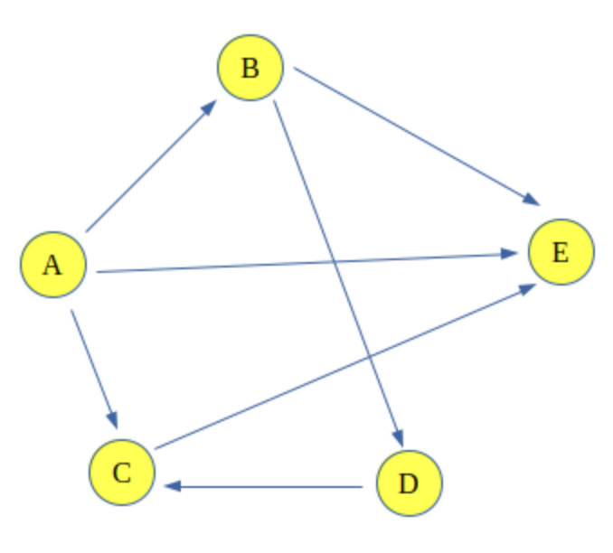
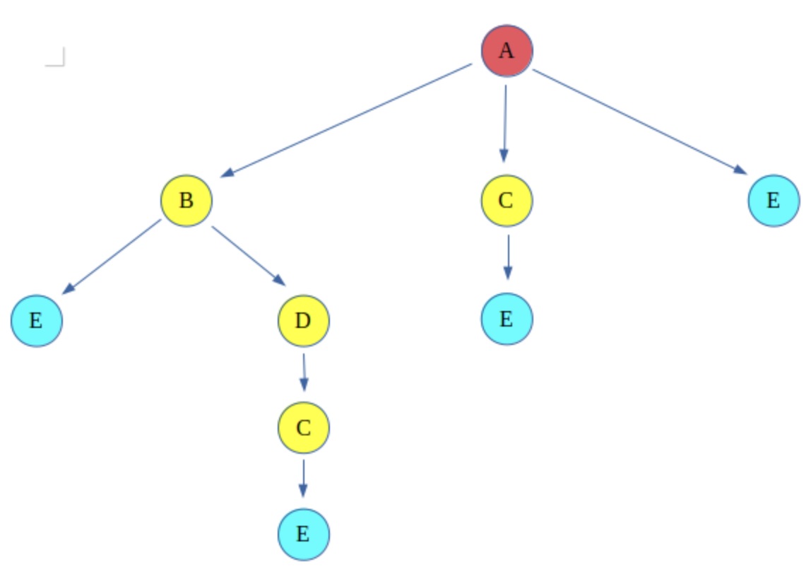
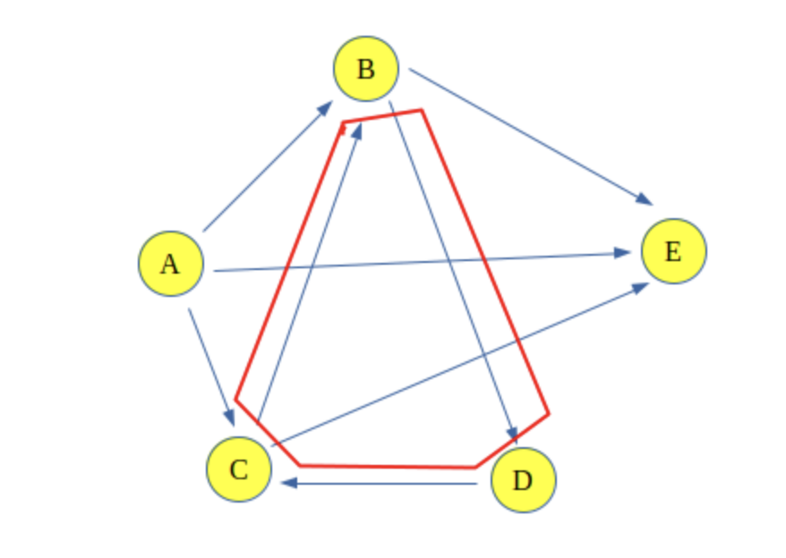

# Count all possible Paths between two Vertices

Code: [countPathsBetweenVertices.py](countPathsBetweenVertices.py)

> Count the total number of ways or paths that exist between two vertices in a directed graph. These paths don't contain a cycle, the simple enough reason is that a cycle contains an infinte number of paths and hence they create a problem.

Examples:



<h4> Example 1 </h4>

> Input: Count paths between A and E <br>
> Output: Total paths between A and E are 4 <br>
> Explanation: The 4 paths between A and E are:

```
A -> E

A -> B -> E

A -> C -> E

A -> B -> D -> C -> E
```

<h4>Example 2</h4>

> Input: Count paths between A and C <br>
> Output: Total paths between A and C are 2  <br>
> Explanation: The 2 paths between A and C are:  <br>

```
A -> C

A -> B -> D -> C
```

<details>
<summary>How does it work?</summary>

<br>
The problem can be solved using backtracking, which says to take a path and start walking on it and check if it leads us to the destination vertex then count the path and backtrack to take another path. If the path doesn't lead to the destination vertex, discard the path. This type of graph traversal is called Backtracking traversal.



The red color vertex is the source vertex and the light-blue color vertex is the destination, rest are either intermediate or discarded paths.

</details>

<details>
<summary>Why this solution will not work for a graph which contains cycles?</summary>



The problem associated with this is that now if one more edge is added between C and B, it would make a cycle A -> (B -> D -> C -> B). And hence after every cycle through the loop, the length path will increase and that will be considered a different path, and there would be infinitely many paths because of this cycle.

</details>

<details>
<summary>PSEUDOCODE</summary>

```python
1. Create a recursive function that takes the index of a node of a graph and the destination index. Keep a global or a static variable count to store the count.
2. Keep a record of the nodes visited using a visited array and while returning mark the current node to be unvisited to discover other paths.
  3. If the current node is the destination then increase the count.
  4. Else for all the adjacent nodes, i.e. nodes that are accessible from the current node, call the recursive function with the index of the adjacent node and the destination.
5. Print the count as the required answer.
```

</details>

<details>
<summary>Complexity</summary>


</details>

<details>
<summary>References</summary>

- [geekforgeeks](https://www.geeksforgeeks.org/count-possible-paths-two-vertices/?ref=lbp)

</details>