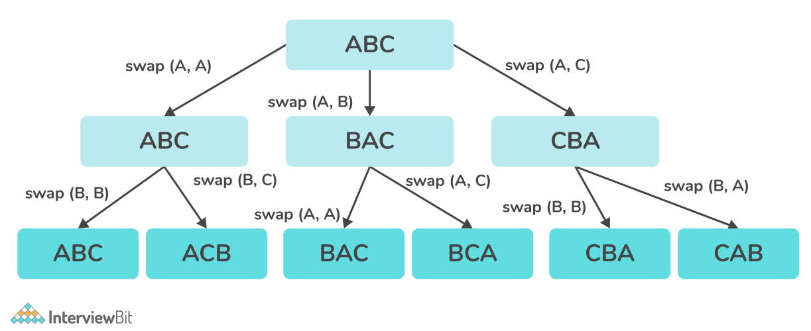

# Permutation of a String

 

1. The backtracking function considers the first index of the string.

2. If the index is N, i.e. length of the string, it means that current permutation is completed.

3. Run a loop from current index idx till N-1 and do the following:

- Swap S[i] and S[idx]
- Construct all other possible permutations, from backtrack(idx + 1)
- Backtrack again, i.e. swap(S[i], S[idx])
