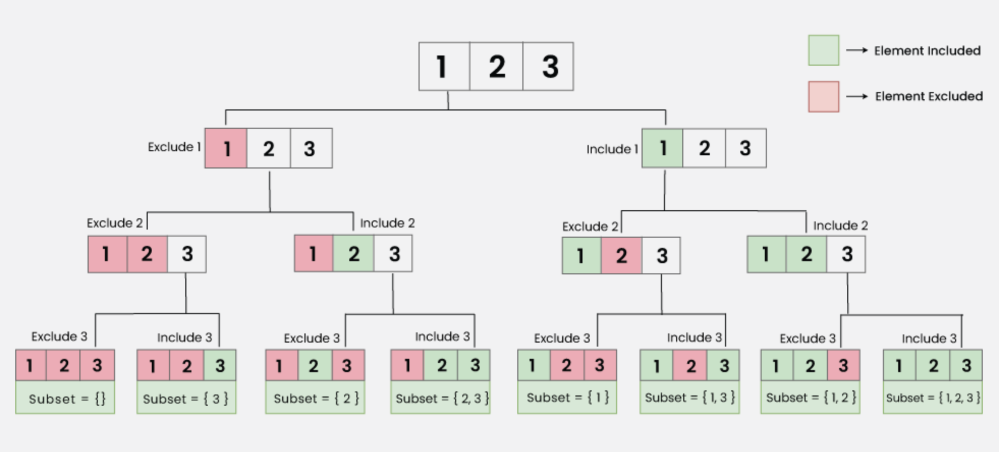

# Subsets Of Given Array

> Given an array Arr[] of size N, print all the subsets of the array.

- Subset: A subset of an array is a tuple that can be obtained from the array by removing some (possibly all) elements of it.

Example 1: 
> Input N = 3, Arr = [1,2,3]
> Output: {}, {1}, {2}, {3}, {1,2}, {1,3}, {2,3}, {1,2,3}

Explanation: These are all the subsets that can be formed from the given array, it can be proven that no other subset exists other than the given output.

Example 2:
> Input N = 2, Arr = [2,4]
> Output: {}, {2}, {4}, {2,4}

How many subsets are possible for an Array of size 'N'?

We can observe a relation between the size of array N and the number of subsets formed by that array. There exists a relation given by the following formula:

Number of subsets of an array of size $N = (2)^N$

Proof: For each element of the array we have 2 choices:
1. Choice 1: Include it into the subset.
2. Choice 2: Exclude it from the subset.

Since each element has 2 choice to contribute into the subset and we have total N elements, therefore total subsets = $(2)^N$

<h3>State Space Tree for printing all subsets using Backtracking:</h3>

Suppose an array of size 3 having elements {1,2,3}, the state space can be constructed as follows:

<h3>PSEUDOCODE</h3>
<ol>
<li>It starts with an empty subset and adds it to the result list.</li>
<li>It iterates through the elements of the input vector.</li>
<li>
     <ol>
     <li>Includes the current element in the subset.</li>
     <li>Recursively calls itself with the updated subset and the next index</li>
     <li>Excludes the current element from the subset (backtracks)</li>
     </ol>
</li>
</ol>