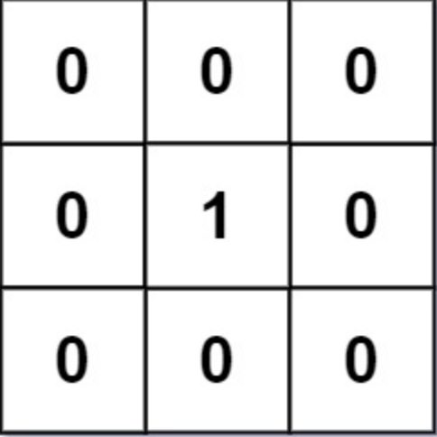
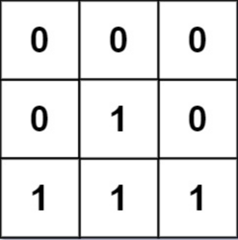

# 01 Matrix

Given an m x n binary matrix mat, return the distance of the nearest 0 for each cell.

The distance between two adjacent cells is 1.

<h2> Example 1 </h2>



Input: mat = [[0,0,0],[0,1,0],[0,0,0]]

Output: [[0,0,0],[0,1,0],[0,0,0]]

<h2> Example 2 </h2>



Input: mat = [[0,0,0],[0,1,0],[1,1,1]]

Output: [[0,0,0],[0,1,0],[1,2,1]]

<h2>Constraints:</h2>

- m == mat.length
- n == mat[i].length
- 1 <= m, n <= 104
- 1 <= m * n <= 104
- mat[i][j] is either 0 or 1.
- There is at least one 0 in mat.

<h2>Reference</h2>

[leetcode](https://leetcode.com/problems/01-matrix/)

<h2>Algorithm Development</h2>

1. Initialize the Result Matrix

- Create a result matrix to store the distances
- Initialize it with a large value for representing infinite distance

2. Identify Starting Points

- Identify the '0' cells as starting points for the distance calculation.

3. Graph Traversal (BFS)

- For each '0' cell, perform BFS to calculate distances to all other cells.
- Use a queue to explore neighboring cells.

4. Update Result Matrix

- Update the result matrix with the calculated distances

5. Repeat for all '0' cells

- Repeat the process for all '0' cells to cover the entire matrix.

<h2>Pseudocode</h2>

<ul>
<li>&nbsp;def main:</li>
<li>&nbsp;&nbsp;Recibe como parámetro la matriz original > mat</li>
<li>&nbsp;&nbsp;Inicializa variables filas y columnas > rows, cols</li>
<li>&nbsp;&nbsp;Genera una matriz de filas x columnas, cada entrada es -inf > result</li>
<li>&nbsp;&nbsp;Para cada fila > i:</li>
<li>&nbsp;&nbsp;&nbsp;Para cada columna > j:</li>
<li>&nbsp;&nbsp;&nbsp;&nbsp;Si la matrix[rows][cols] == 0:</li>
<li>&nbsp;&nbsp;&nbsp;&nbsp;&nbsp;Llamamos breadth_first_search(mat, i, j)</li>
<li>&nbsp;&nbsp;Regresa result</li>

- def breadth_first_search(mat, i, j)
-    Inicializa un double-ended queue con tuplas > queue = (indice_i, indice_j, distancia = 0) (agrega al final de la cola)
-    Mientras haya tuplas en queue:
-         Obten la primer tupla (FIFO)
-         Checa si la distancia es menor a la distancia registrada actualmente (al inicio todo es inicializado a infinito)
-              Actualiza la distancia
-              Explora los vecinos norte, sur, este, oeste > ```get_neighbors(mat, i, j)```
-                   Agrega cada vecino al queue como una tupla (nuevo_indice_vecino_i, nuevo_indice_vecino_j, distancia + 1)

- def get_neighbors(mat, i, j)
-    Inicializa una lista de vecinos vacía > vecinos = []
-    Inicializa una variable con las direcciones a N,S,E,O
-    Para cada dirección N,S,E,O:
-         Actualiza el índice i, j > (ni, nj)
-         Si la nueva posición es válida:
-              Agrega la posición como una tupla a la lista de vecinos > vecinos.append((ni, nj))

<h2>Notas</h2>

- ```deque``` stands for "double-ended queue", datastructure provided by ```collections``` module. It's similar to a list but it allows for fast & efficient append and pop operations on both ends.
- Using a ```deque``` for the queue in BFS is beneficial because it provides O(1) time complexity for both append and pop operations from both ends of the queue. This is particularly useful in BFS, where you frequently add elements to the end of the queue and remove elements from the front.
- The ```popleft()``` method is used to efficiently retrieve and remove the leftmost element from the deque, simulating a queue's behavior. This ensures that elements are processed in the order they were added, implementing a First-In-First-Out (FIFO) strategy, which is essental for BFS traversal.

<h2>Comparación con Algoritmo Flood Fill or Island Perimeter</h2>

The classification of algorithms as dynamic programming or not often depends on the nature of the problem and the characteristics of the solution approach. The reasons for classifying '01 Matrix' as potentially involving dynamic programming while 'Flood Fill' and 'Island Perimeter' are not typically classified in the same way, are as follows:

1. **Overlapping Subproblems and Optimal Substructure:**
   - Dynamic programming problems typically exhibit overlapping subproblems, where the solution to a subproblem is reused in solving multiple larger subproblems.
   - They also usually have optimal substructure, meaning the optimal solution to the overall problem can be constructed from the optimal solutions of its subproblems.

2. **Recursive Nature:**
   - Dynamic programming often involves a recursive approach where solutions to subproblems are built up incrementally.
   - '01 Matrix' has a recursive nature, especially when solving the problem in two passes (from top-left to bottom-right and vice versa), which aligns with the recursive nature common in dynamic programming.

3. **Memoization or Tabulation:**
   - Dynamic programming solutions often use techniques like memoization (top-down approach) or tabulation (bottom-up approach) to store and reuse solutions to subproblems.
   - '01 Matrix' can be solved using a dynamic programming approach with memoization or tabulation.

On the other hand:

- **'Flood Fill' and 'Island Perimeter':**
   - These problems are more naturally approached using graph traversal or direct iteration without the need for storing and reusing solutions to overlapping subproblems.
   - They don't exhibit the same recursive nature and optimal substructure as classic dynamic programming problems.

In summary, while '01 Matrix' can be approached using dynamic programming principles due to its recursive nature and potential overlapping subproblems, 'Flood Fill' and 'Island Perimeter' are more straightforward problems that don't exhibit the same characteristics and are typically solved using graph traversal or direct iteration. It's important to note that problem classification is not always rigid, and different perspectives may exist.