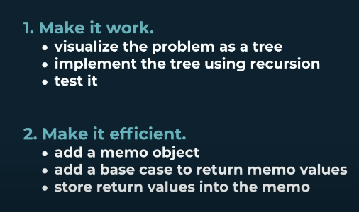

# Dynamic Programming

<details>
<summary>Dynamic Programming definitions</summary>

1. 

2. 

</details>

<details>
<summary>Why is it used?</summary>

1. 
</details>

<details>
<summary>Terminologies</summary>

1. 

</details>

<details>
<summary>Types of Dynamic Programming problems</summary>

1. 
2. 

</details>

<details>
<summary>How does it work?</summary>

- 

</details>


<details>
<summary>Determining Dynamic Programming problems</summary>

</details>

<details>
<summary>PSEUDOCODE for Dynamic Programming</summary>

</details>

<details>
<summary>Complexity</summary>


</details>

<details>
<summary>Memoization Recipe</summary>

- The most important thing is to stick to: First make it work via brute - force (correctness). Second, make it efficient via memoization (efficiency).

- To make it work: visualize the problem as a tree. The nodes of a tree represents the problem. Drawing an edge represents shrinking the problem. The key is to figure out the logic of shrinking the problem.

- Implement the tree using recursion. How to translate the tree visualization to code? Think of the base line recursive case. Test it. Because there's a big difference between code that's slow & code that's wrong.

- After correctness, memoize. Map parameters to solutions. Add a new base case that captures the memo. If the arguments are in the memo object, return the stored value. Then implement **memo storing logic**, which is going to the return objects in the brute forced, and write code around the return.



</details>

<details>
<summary>Tabulation Recipe</summary>

- Visualize the problem as a table
- Size the table based on the inputs
- Initialize the table with default values
- Seed the trivial answer into the table
- Iterate through the table
- Fill further positions based on the current position (logic comes in different from problem to problem) -> it relates to the 'logic of shrinking with each recursion call'. In other words, seek 'for the language of the problem'.

</details>


|Problem|Description|Example|
| :----: | :----: | :----: |
|[Fibonacci](./Fibonacci/README.md)|Write a function fib(n) that takes in a number as an argument. The function should return the n-th number of the fibonacci sequence. The 1st and 2nd number of the sequence is 1. To generate the next number of the sequence, we sum the previous two.|Input: n=9, Output: 24|
|[Grid Traveler](./gridTraveler/README.md)|Say that you are a traveler on a 2D grid. You begin in the top-left corner and your goal is to travel to the bottom-right corner. You may only move down or right. In how many ways can you travel to the goal on the grid with dimensions $m * n$.|Input (m,n) = (3,3), Output: 6|
|[Can Sum](./canSum/README.md)|Write a function ```canSum(targetSum, numbers)``` that takes in a targetSum and an array of numbers as arguments. The function should return a boolean indicating whether or not it is possible to generate the targetSum using numbers from the array. Can you do it? yes/no => It is a **Decision Problem**|```canSum(7, [5,3,4,7])``` -> true|
|[How Sum](./howSum/README.md)|The function should return an array containing any combination of elements that add up to exactly the targetSum. If there is no combination that adds up to the targetSum then return null. How will you do it? => It's a **Combinatoric Problem**|```howSum(7, [2,3,4,7])``` -> [2,2,2,2]|
|[Best Sum](./bestSum/README.md)|The function should return an array containing the shortest combination of numbers that add up to exactly the targetSum. What is the best way to do it? => It's an **Optimization Problem**|```bestSum(7, [5,3,4,7])``` -> [7]|
|[Can Construct](./canConstruct/README.md)|Write a function ```canConstruct(target, wordBank)``` that accepts a target string and an array of strings. The function should return a boolean indicating whether or not the ```target``` can be constructed by concatenating elements of the ```wordBank``` array.|```canConstruct(abcdef, [ab, abc, cd, def, abcd])``` -> True "abc" + "def"|
|[Count Construct](./countConstruct/README.md)|Write a function ```countConstruct(target, wordBank)``` that accepts a target string and an array of strings. The function should return the number of ways that the ```target``` can be constructed by concatenating elements of the ```worldBank``` array.|```countConstruct(purple, [purp, p, ur, le, purpl]) -> 2```|
|[All Construct](./allConstruct/README.md)|||
|[01 Matrix](./01Matrix/README.md)|Given an m x n binary matrix mat, return the distance of the nearest 0 for each cell.The distance between two adjacent cells is 1.|Input: mat = [[0,0,0],[0,1,0],[1,1,1]], Output: [[0,0,0],[0,1,0],[1,2,1]]|
||||

