# All Construct Tabulated

<h2>Description</h2>

Write a function ```allConstruct(target, wordBank)``` that accepts a target string and an array of strings.

The function should return a 2D array containing ```all of the ways``` that ```target``` can be constructed by concatenating elements of the ```wordBank``` array. Each element of the 2D array should represent one combination that constructs the ```target```.

<h2>Example</h2>

```countConstruct(abcdef, [ab, abc, cd, def, abcd, ef, c]) -> 4```

[
     [ab, cd, ef],<br>
     [ab, c, def],<br>
     [abc, def],<br>
     [abcd, ef]
]

```countConstruct('', [cat, dog]) -> [ [] ]```

[
     []
]

```countConstruct('birds', [cat, dog]) -> []```

[]

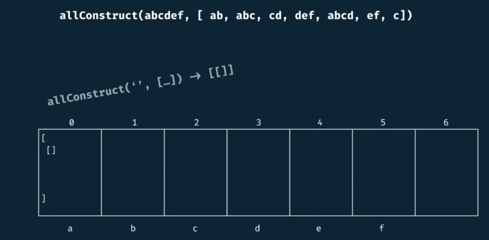

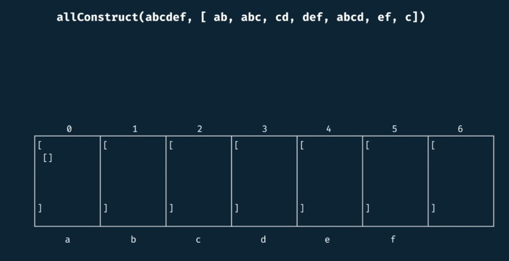

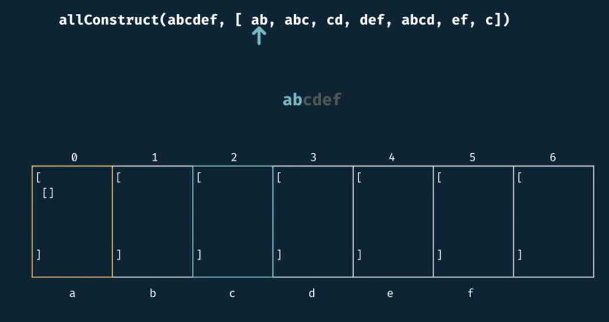

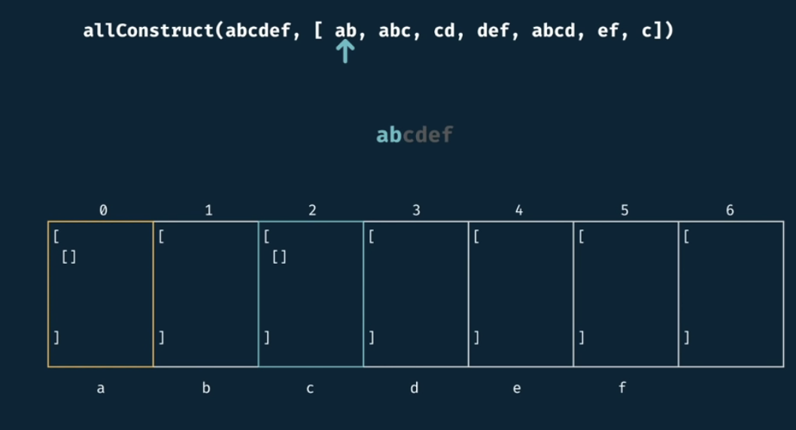

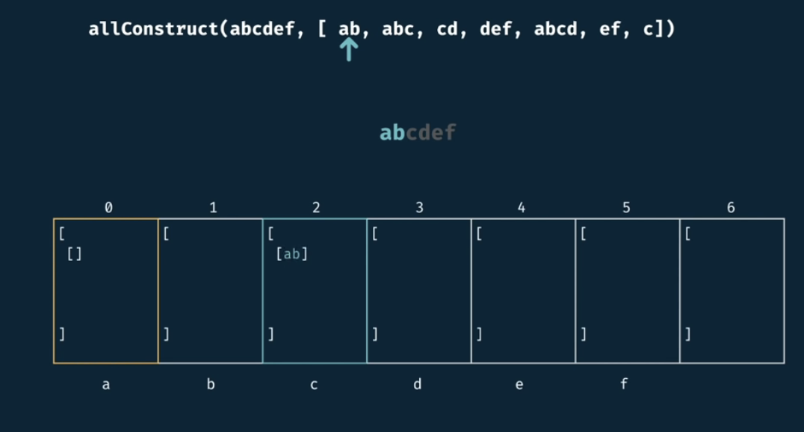

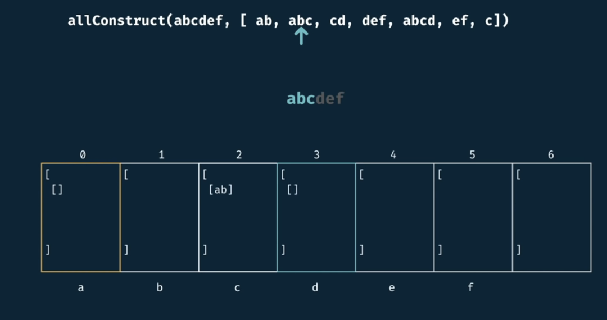

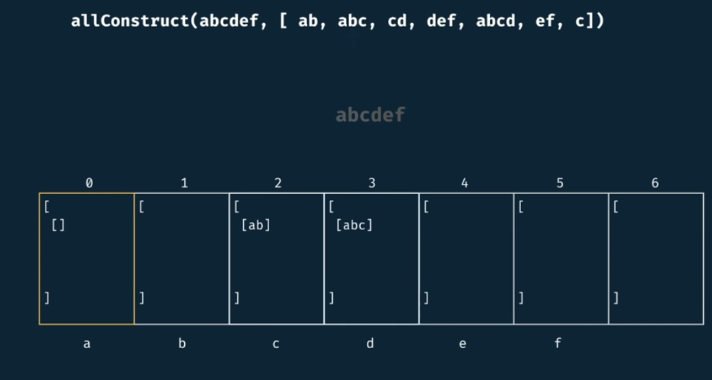

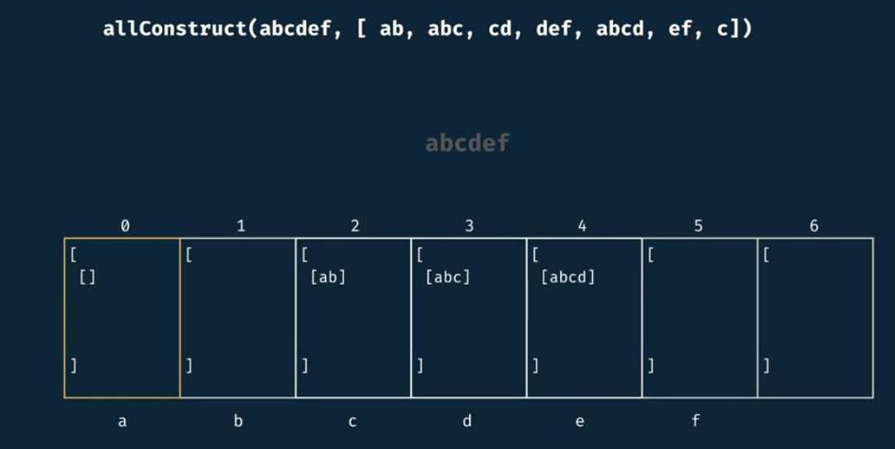

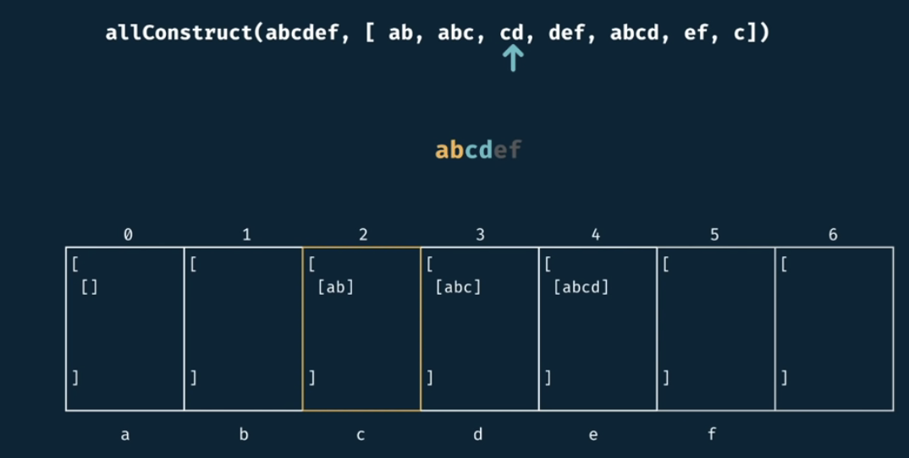

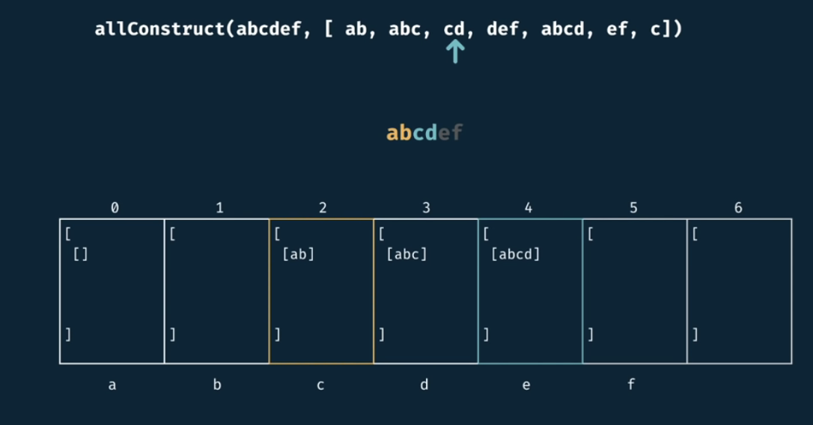

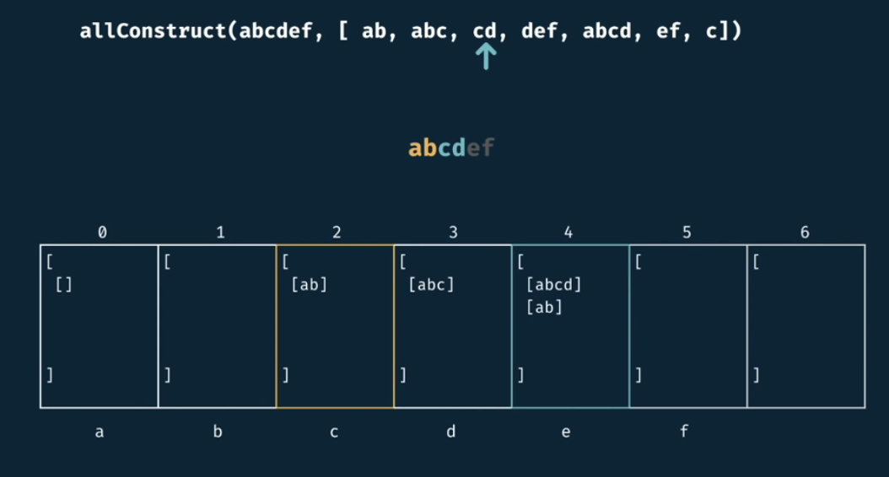

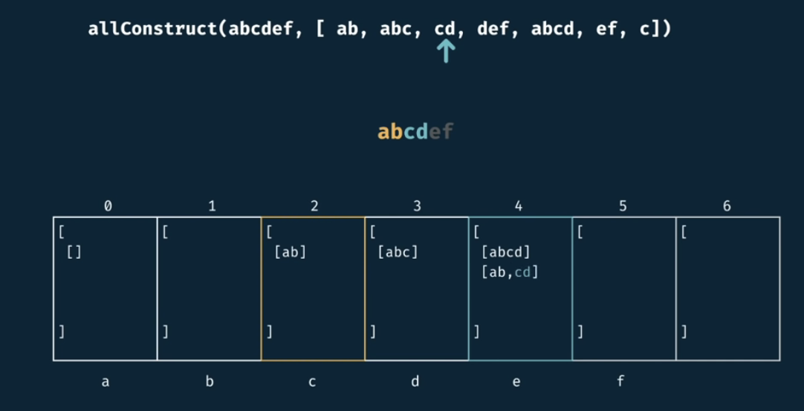

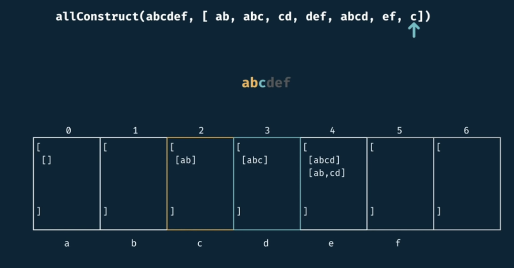

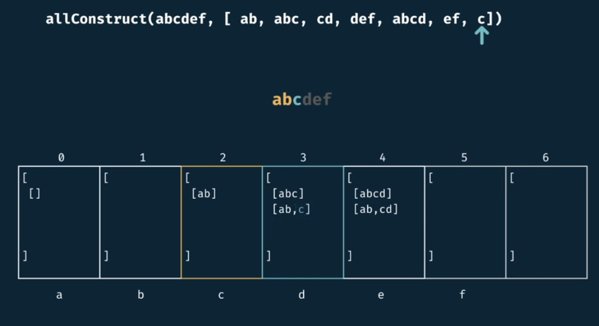

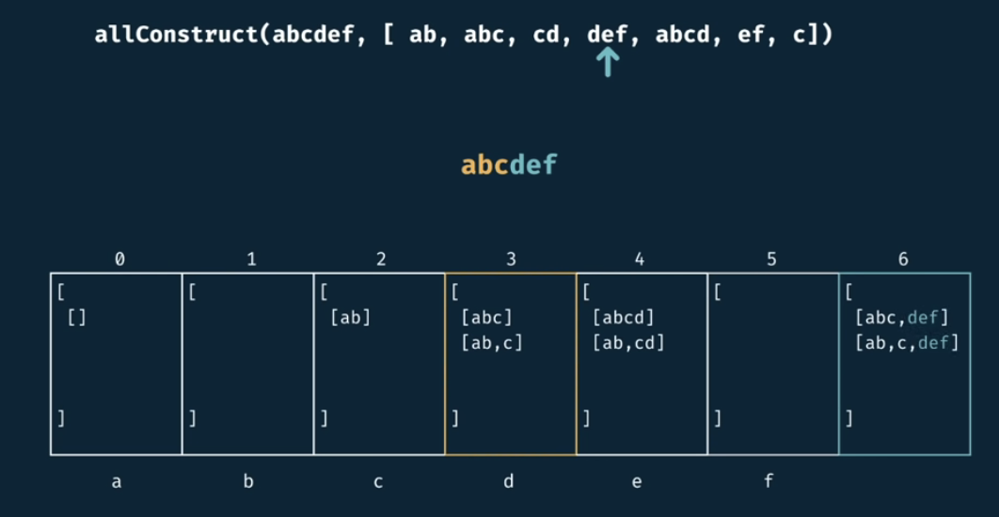

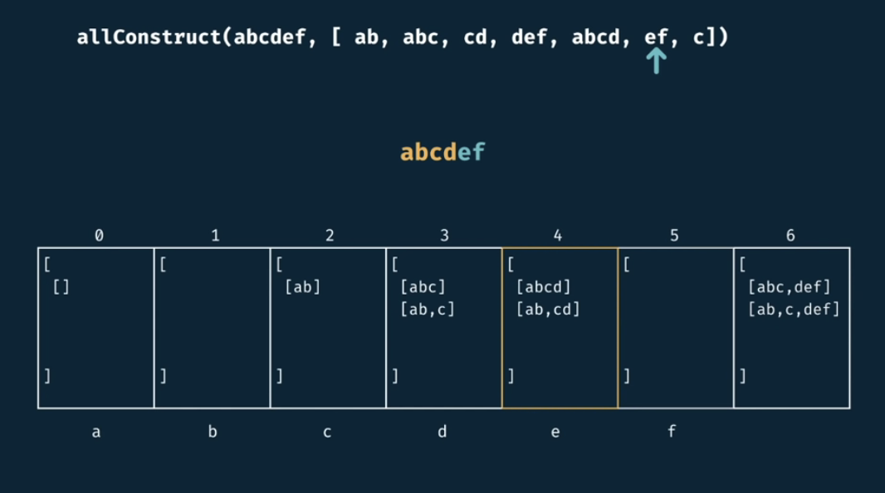

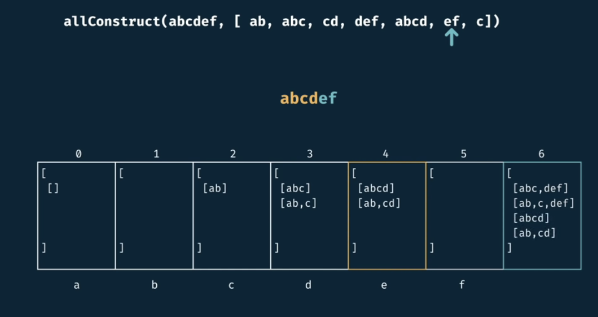

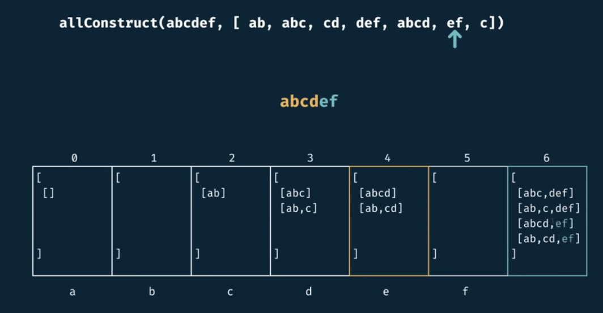

Notice that every position at the table makes a logical statement about the target string.

For example, at index 3, we can make **abc** via *abc* & *ab, c*.

In index 5, we can never generate *abcde*.

## Complexity

$m = target.length$
$n = wordBank.length$

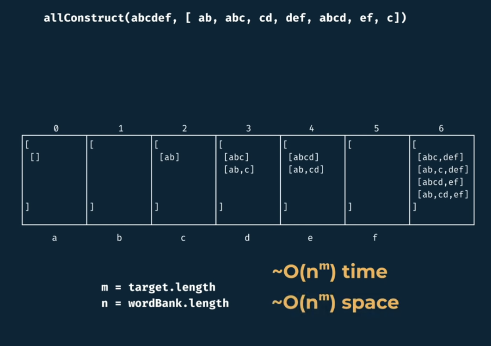
