# All Construct

<h2>Description</h2>

Write a function ```allConstruct(target, wordBank)``` that accepts a target string and an array of strings.

The function should return a 2D array containing ```all of the ways``` that ```target``` can be constructed by concatenating elements of the ```wordBank``` array. Each element of the 2D array should represent one combination that constructs the ```target```.

<h2>Example</h2>

```countConstruct(abcdef, [ab, abc, cd, def, abcd, ef, c]) -> 4```

[
     [ab, cd, ef],<br>
     [ab, c, def],<br>
     [abc, def],<br>
     [abcd, ef]
]

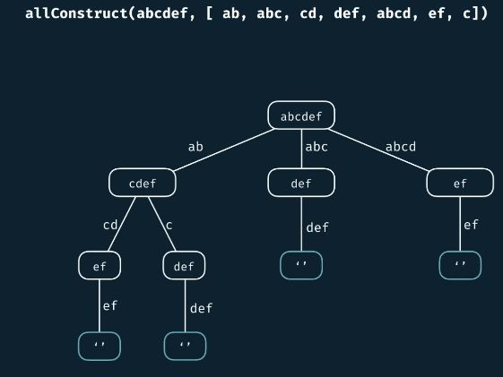

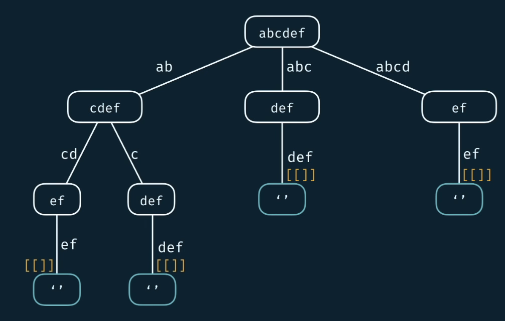

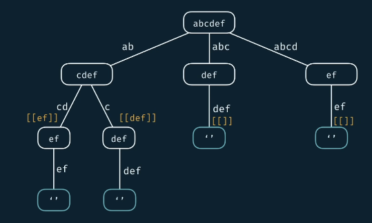

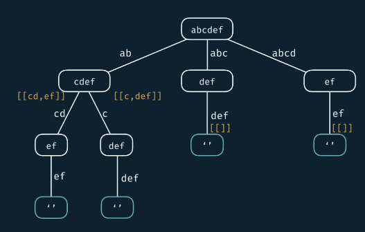

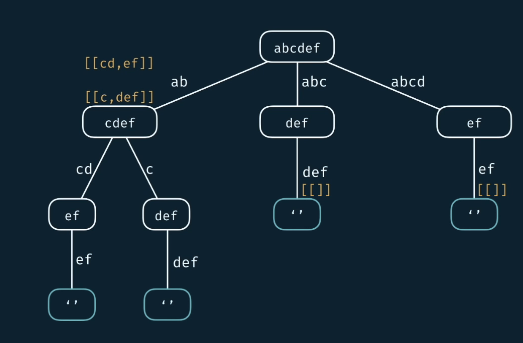

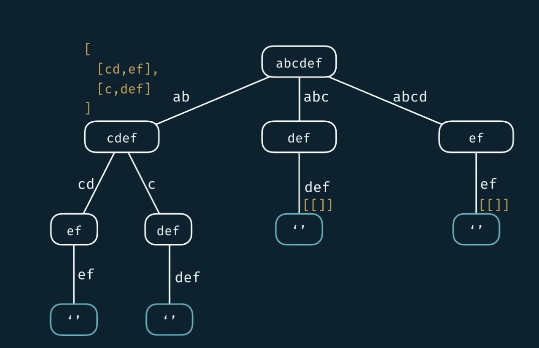

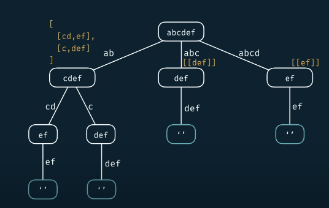

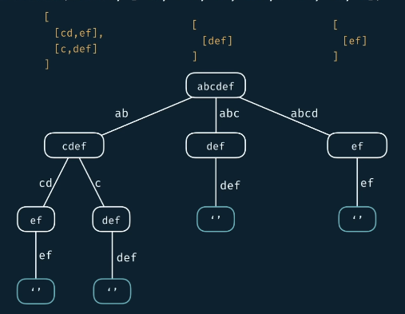

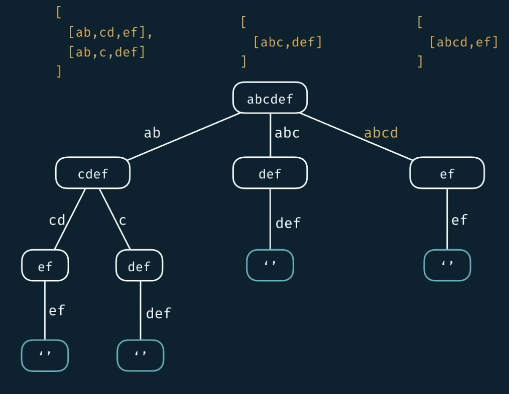

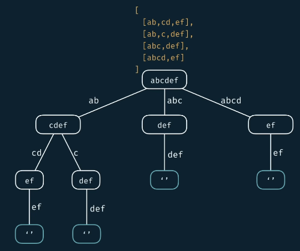


```countConstruct(purple, [purp, p, ur, le, purpl]) -> 2```

[
     [purp, le],<br>
     [p, ur, p, le]
]

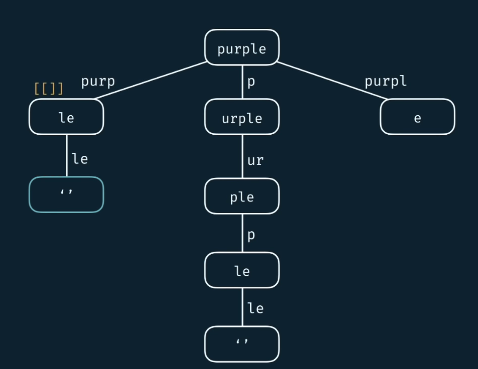

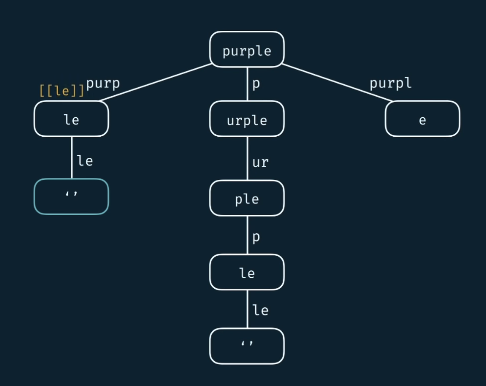

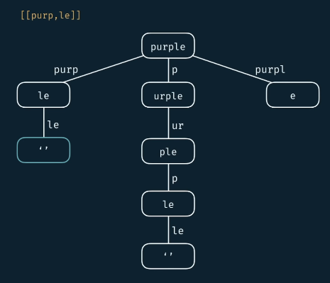

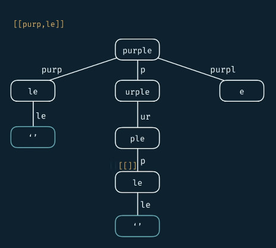

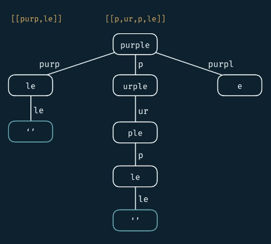

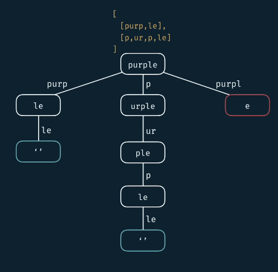

```countConstruct(hello, [cat, dog, mouse]) -> []```

[
<br>
]

```countConstruct('', [cat, dog, mouse]) -> [[]]```

[
     []
]

<h2>Complexity</h2>

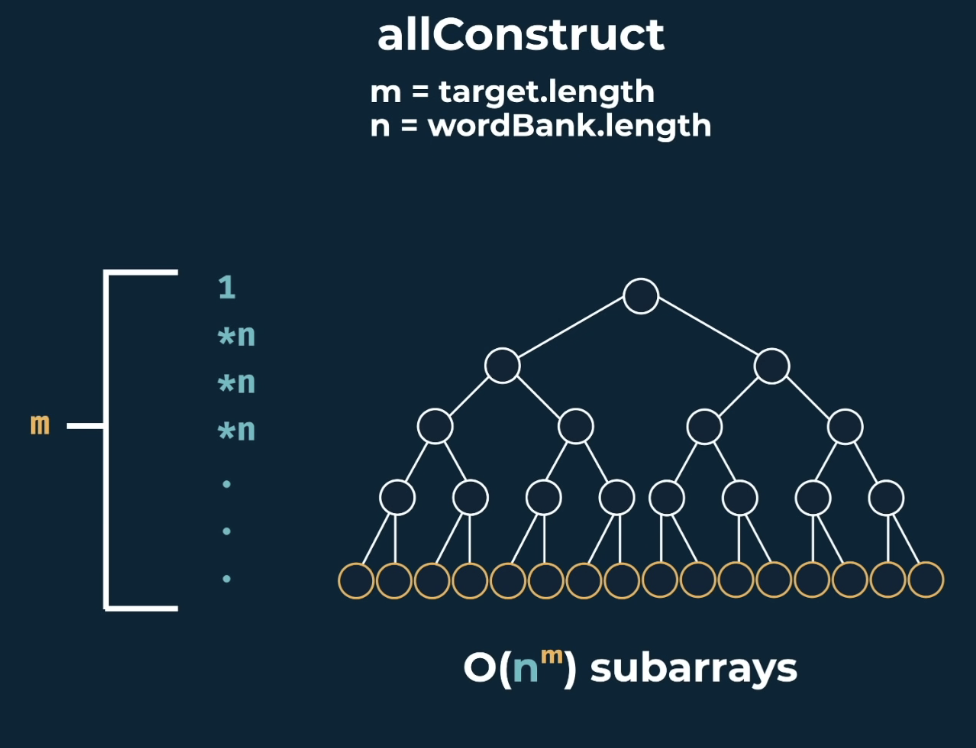

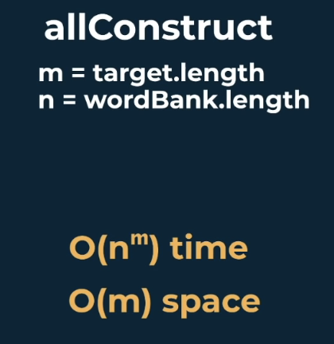