# Best Sum Tabulated

<h2>Description</h2>

Write a function ```bestSumTabulation(targetSum, numbers)``` that takes in a targetSum and an array of numbers as arguments.

The function should return an array containing the shortest combination of numbers that add up to exactly the targetSum.

If there's a tie for the shortest combination, you may return any one of the shortest.

<h2>Example</h2>

```bestSumTabulation(8, [2,3,5]) -> [[2,2,2,2], [3,3,2], [3,5]] => R: [3,5]```

Start by assigning the base case

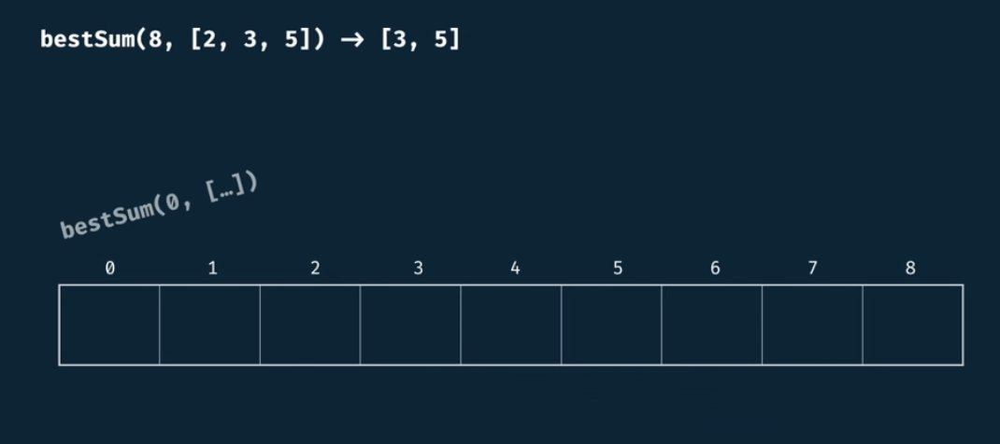

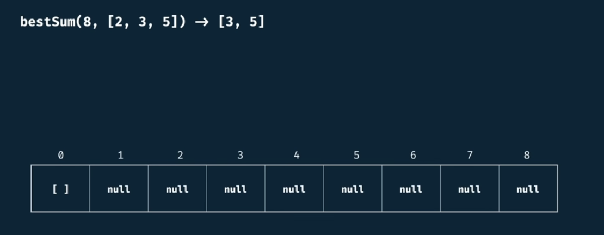

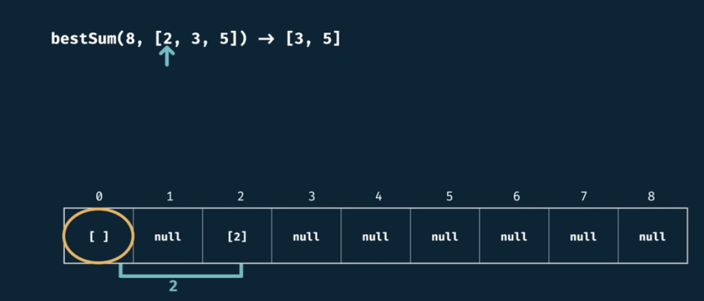

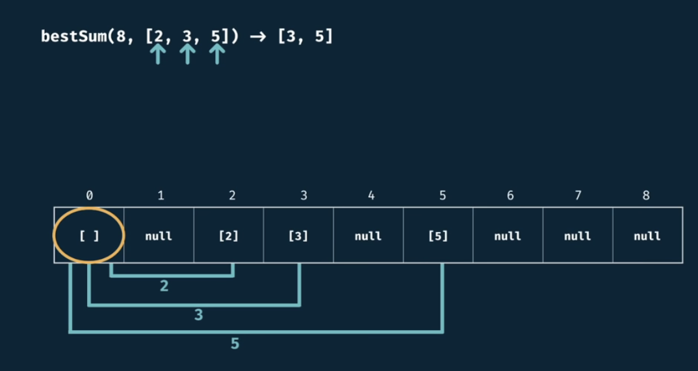

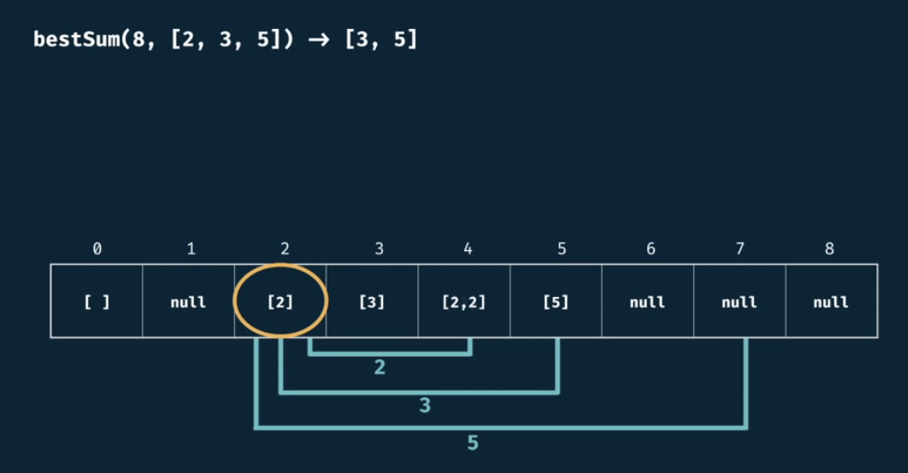

here, we have an overlap of arrays that can generate '5', so we choose the shortest array from both, in this case [5]

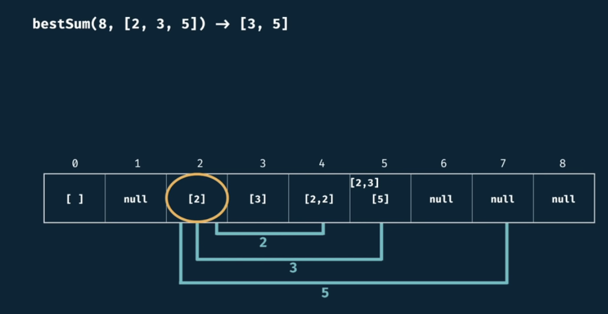

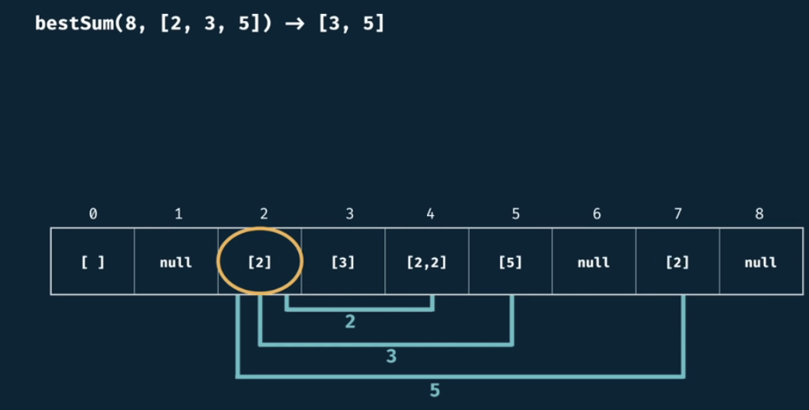

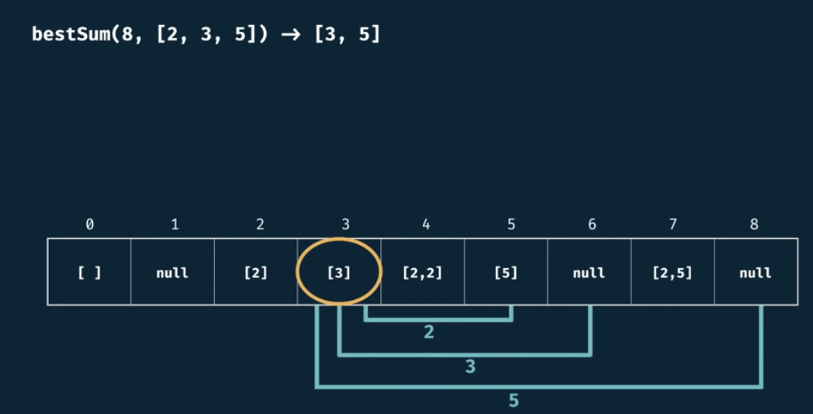

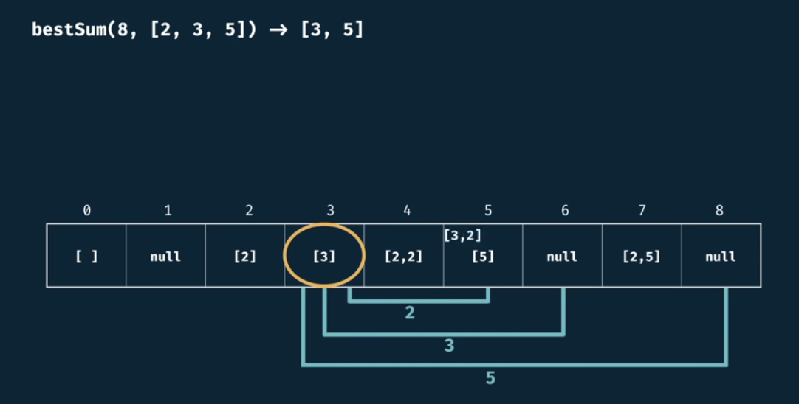

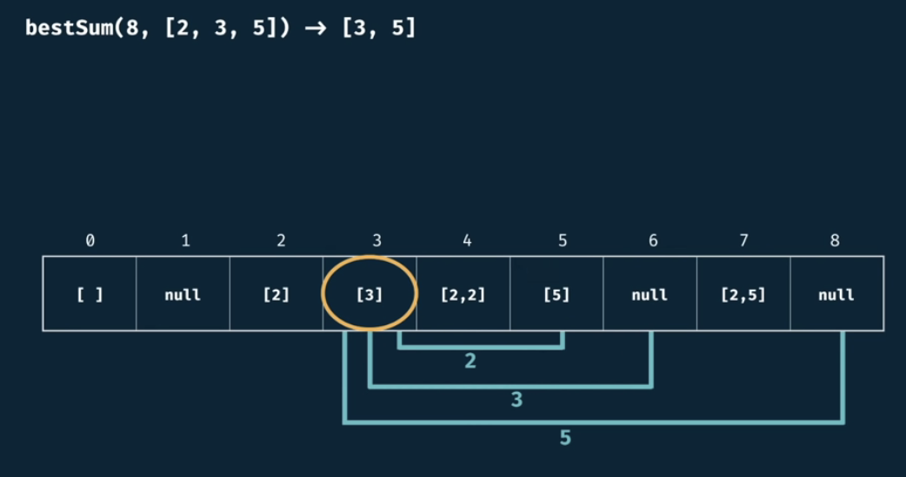

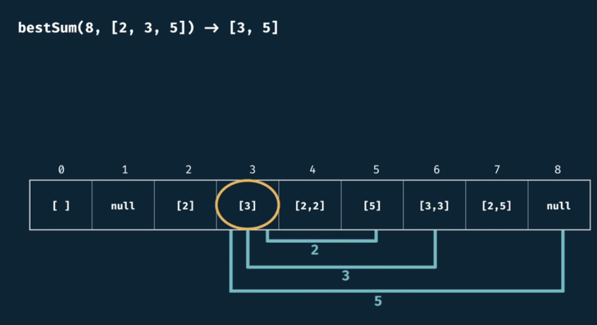

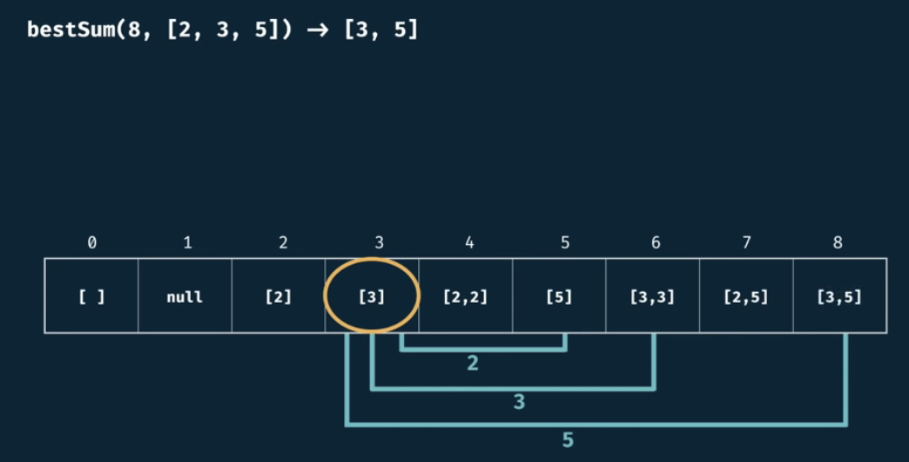

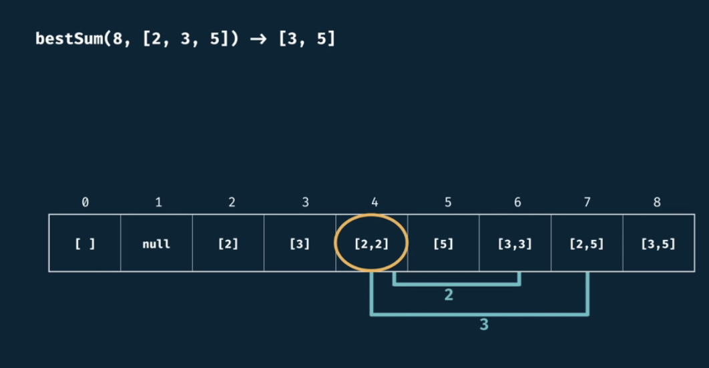

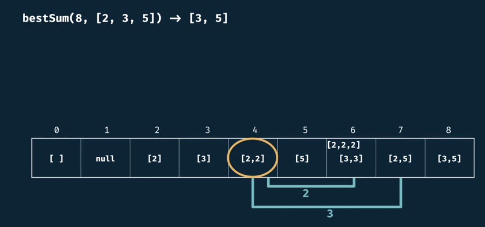

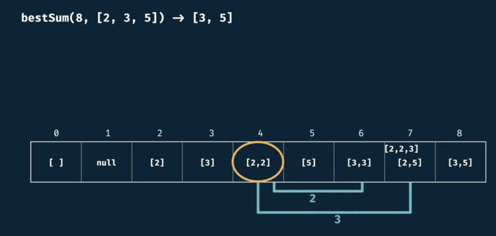

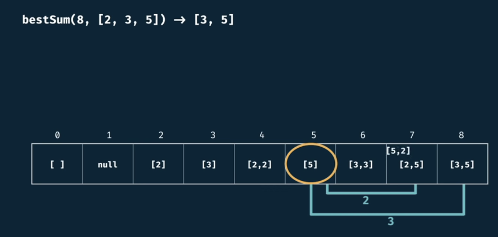

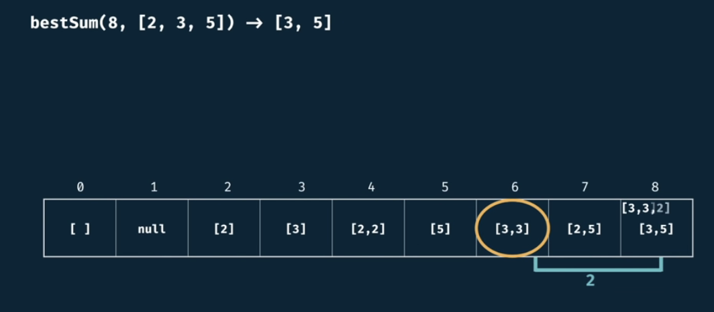


## Complexity

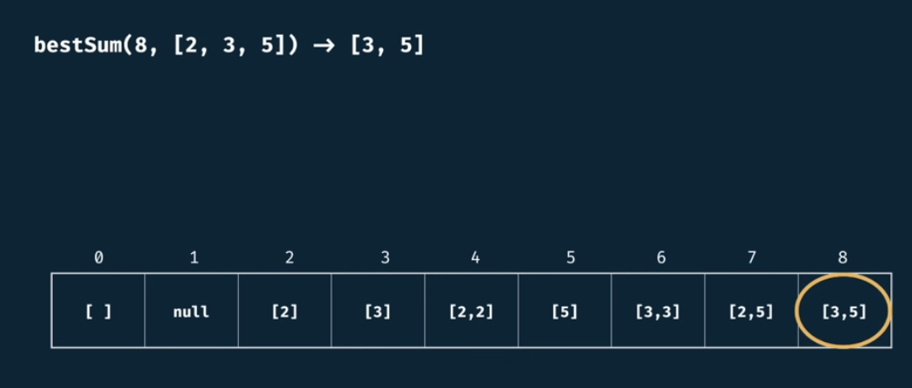