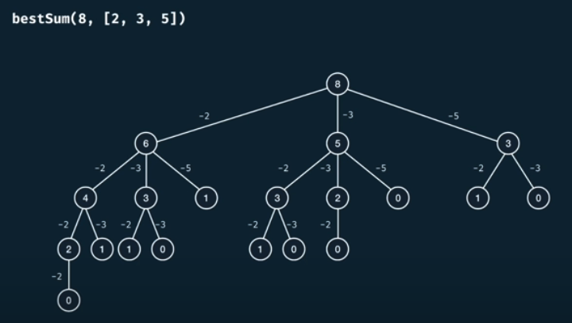
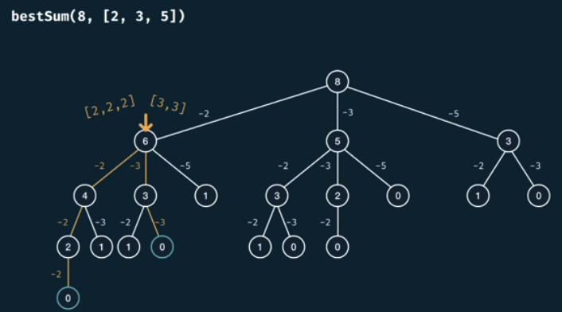
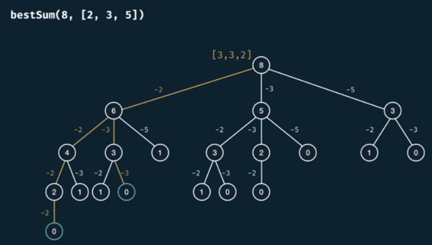
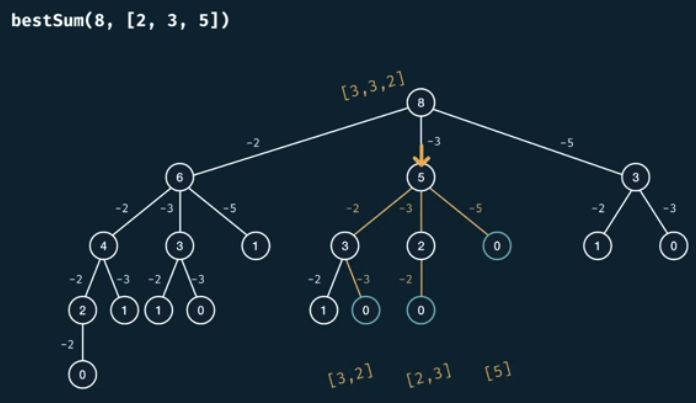
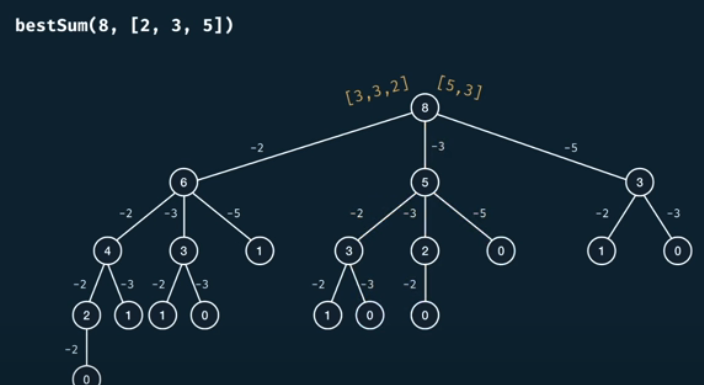
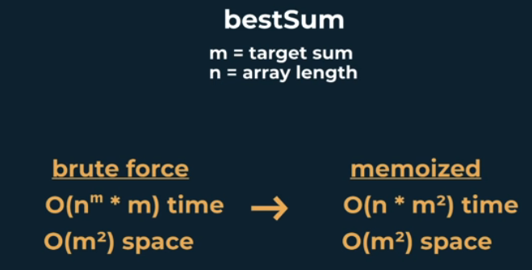

# Best Sum

<h2>Description</h2>

Write a function ```bestSum(targetSum, numbers)``` that takes in a targetSum and an array of numbers as arguments.

The function should return an array containing the shortest combination of numbers that add up to exactly the targetSum.

If there's a tie for the shortest combination, you may return any one of the shortest.

<h2>Example</h2>

```bestSum(7, [5,3,4,7]) -> [[3,4], [7]] => R: [7]```

```bestSum(8, [2,3,5]) -> [[2,2,2,2], [3,3,2], [3,5]] => R: [3,5]```



What strategy are we using to return the best (shortest array) sum?

Say reach 6, there's two subways to generate 6.



The best is [3,3], so we return it to the parent.



Say we take the same process to generate 5.



So we return it to the parent, along with the edge.



So **note**, we cannot return early, we need to check every possibility. 

<h2>Complexity</h2>

We have **m** as targetSum and **n** as the numbers array length, so...

<h3>w/o Memoization</h3>

- Time Complexity: $O(n^m * m)$

- Space Complexity: $O(m * m)$ = $O(m^2)$

<h3>w Memoization</h3>

- Time Complexity: $O(m * n * m)$ $=$ $O(m^2 * n)$

- Space Complexity: $O(m^2)$

