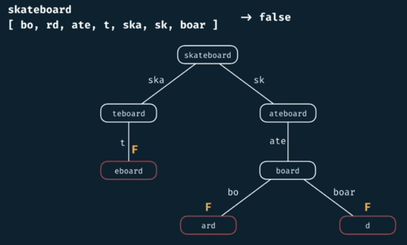

# Can Construct

<h2>Description</h2>

Write a function ```canConstruct(target, wordBank)``` that accepts a target string and an array of strings.

The function should return a boolean indicating whether or not the ```target``` can be constructed by concatenating elements of the ```wordBank``` array.

You may reuse elements of ```wordBank``` as many times as needed.

<h2>Example</h2>

```canConstruct(abcdef, [ab, abc, cd, def, abcd])``` -> True "abc" + "def"

```canConstruct(skateboard, [bo, rd, ate, t, ska, sk, boar])``` -> False

To generate the empty string we could take zero elements from the array. So we'll return True if our target is empty (Base case).

```canConstruct('', [cat, dog, mouse])``` -> True


**New example**



<h2>Complexity</h2>

We want to generalize this understanding for any input. Using different variables for each input, consider the following:

- worst case: we take 1 character from the target word, so the height would be **m: target.length**.

- worst case: the branching factor (how many branches branch from each level to the next), will multiply by **n** (every element in the word bank being a valid (matching) prefix).


<h3>w/o Memoization</h3>

Time Complexity Exponential $O(n^m)$

but considering the **slice** operation, which is O(m) should be taken into account so the time complexity is:

- Time Complexity Exponential $O(n^m * m)$

Consider the line 6 of this figure: (makes space complexity $O(m^2)$)


<h3>w Memoization</h3>


The second **m** in Time Complexity comes from the slice. 

