# Can Sum

<h2>Description</h2>

Write a function ```canSum(targetSum, numbers)``` that takes in a targetSum and an array of numbers as arguments.

The function should return a boolean indicating whether or not it is possible to generate the targetSum using numbers from the array.

We may use an element of the array as many times as we want.

You may assume that all input numbers are nonnegative.

<h2>Examples</h2>

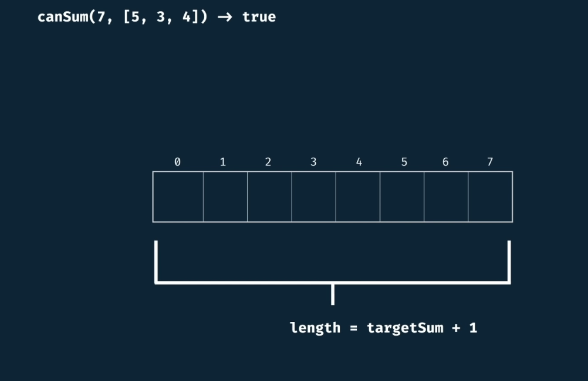

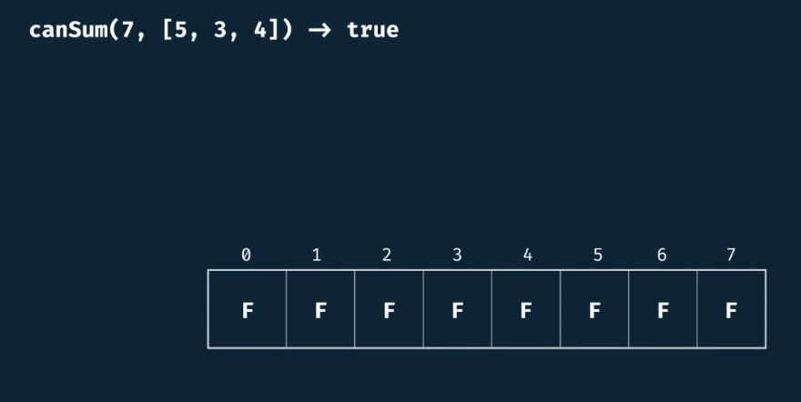

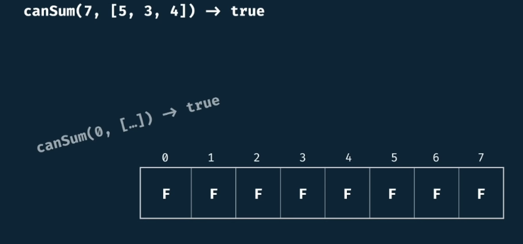

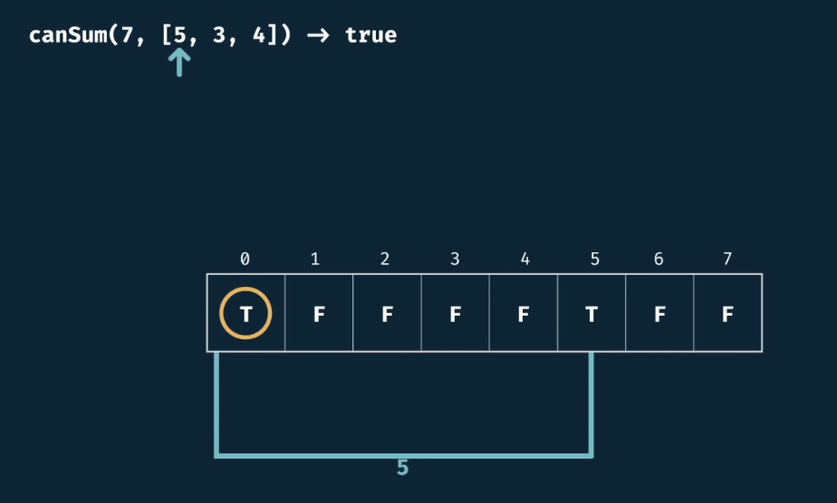

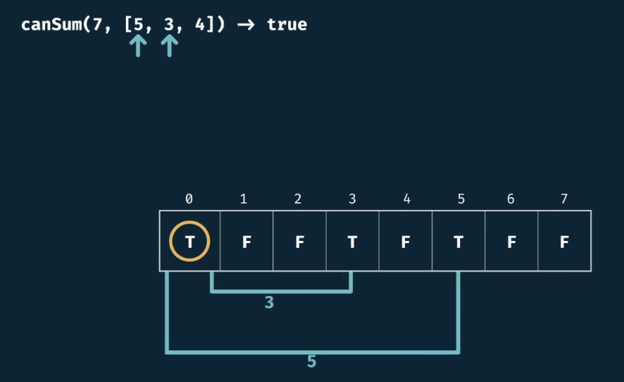

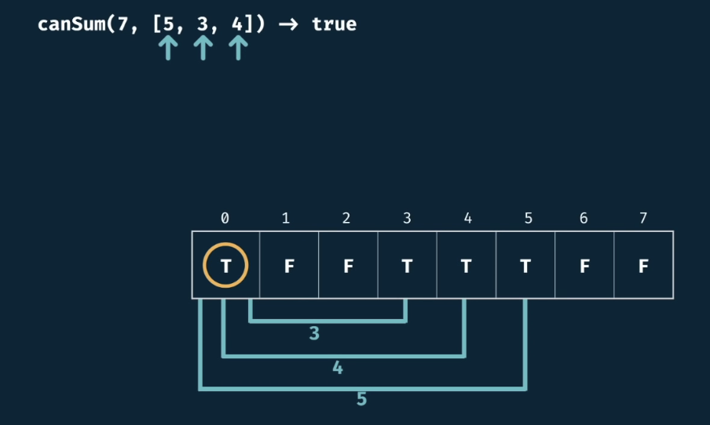

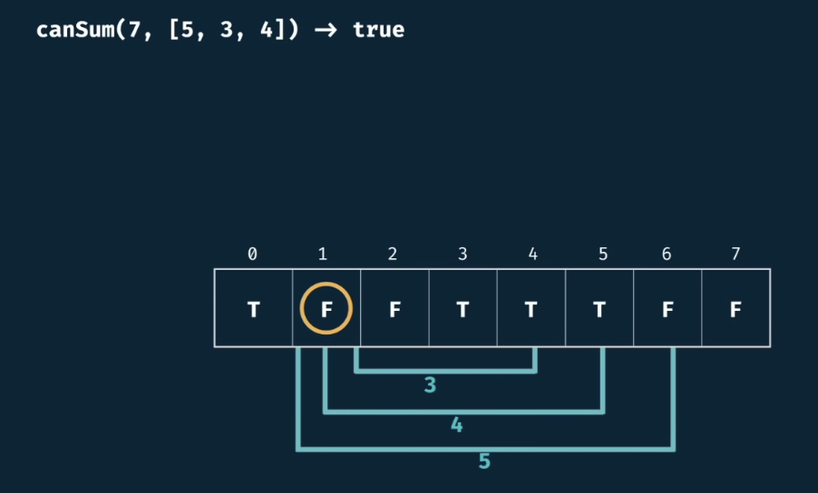

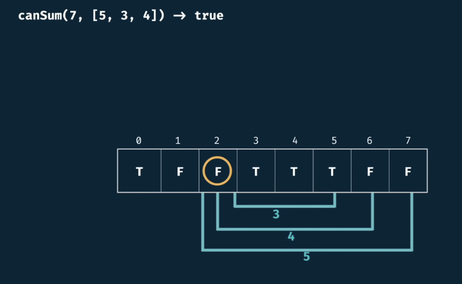

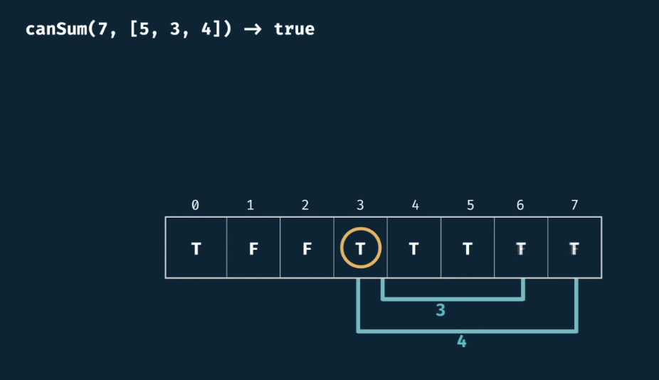

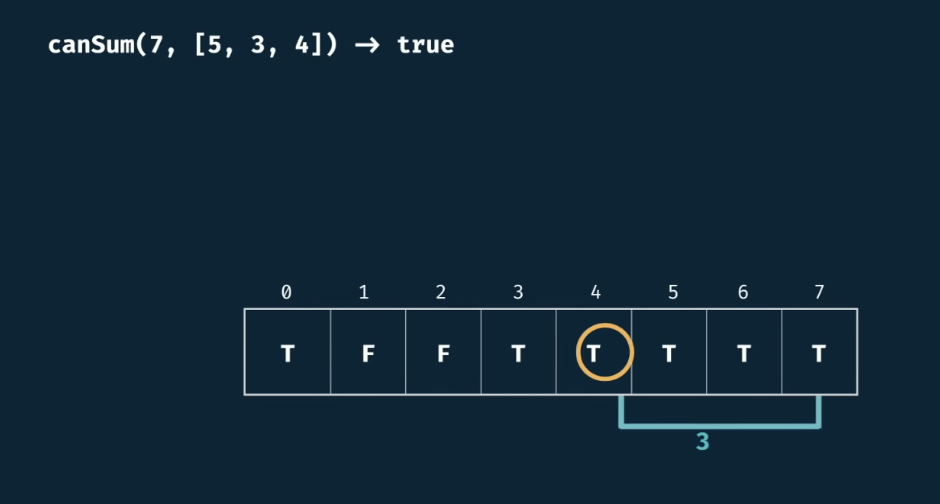

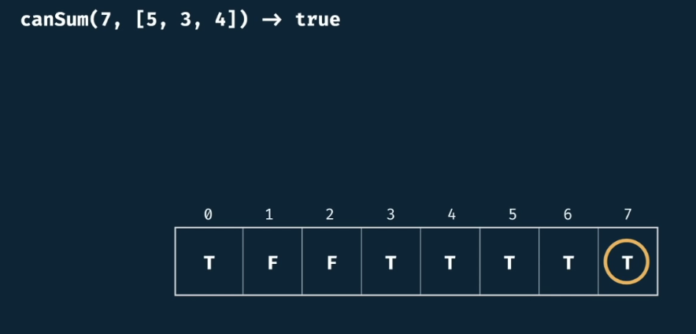

The end of the algorithm will yield the final answer at the final position of the one dimensional array.

## Complexity

m = targetSum

n = numbers.length

- Time Complexity: $O(m*n)$
- Time Complexity: $O(m)$