# Can Sum

<h2>Description</h2>

Write a function ```canSum(targetSum, numbers)``` that takes in a targetSum and an array of numbers as arguments.

The function should return a boolean indicating whether or not it is possible to generate the targetSum using numbers from the array.

We may use an element of the array as many times as we want.

You may assume that all input numbers are nonnegative.

<h2>Examples</h2>

<h3>Example 1</h3>

```canSum(7, [5,3,4,7])``` -> true

Why?

3 + 4 = 7, 7 = 7

How?

Think of how can we shrink the original targetSum, so that we can recursivelly get to a base case. The rule for the transition will be to substract array elements from the targetSum. There will be nodes with no valid shrinking.

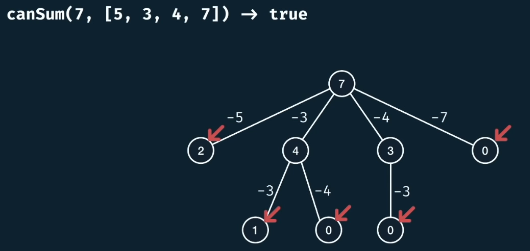

We've reached base case when targetSum is Zero (there's a sum of one or more numbers in the array that equal targetSum).

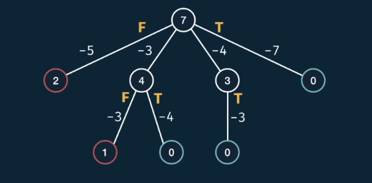

The parent should check if at least one of the child nodes is True.

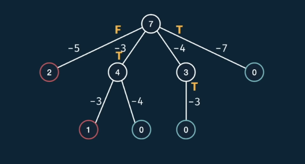

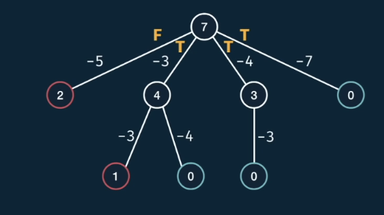

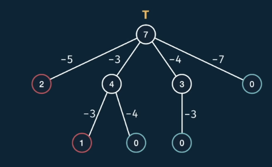

<h3>Example 2</h3>

```canSum(7, [2,4])``` -> false

Why?

No combinations sum 7.

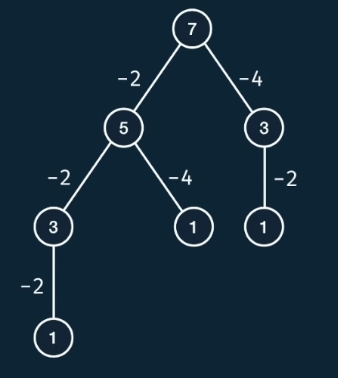

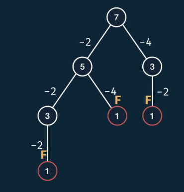

<h2>Complexity</h2>

Describe the complexity in terms of the input to the function. Both of them have an effect on the dimensions of the tree.

- m = target sum

- n = array length

What's the maximum distance from the root of the tree to the furthes leaf?

<h3>Complexity w/o memoization</h3>

In the worst case the distance from the root to the last leaf is **m**, **the number of levels is m**.

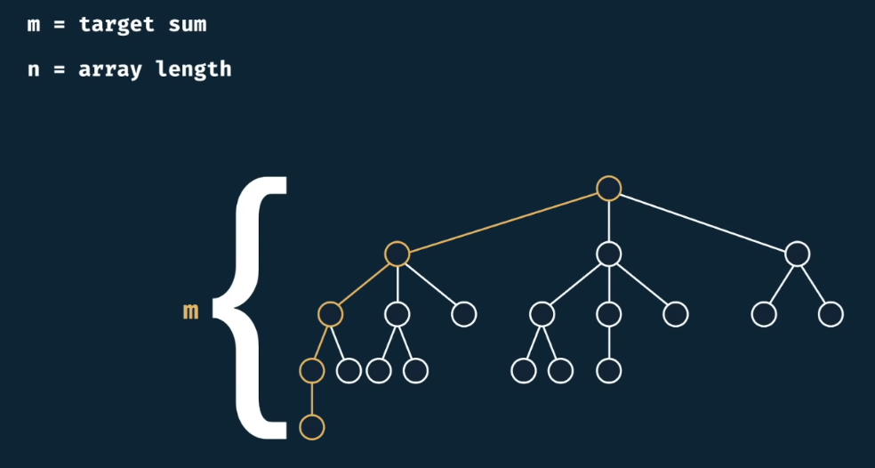

Now, the **branching factor**, how does the node levels change from one level to the next? *n because **n** is the length of the array.

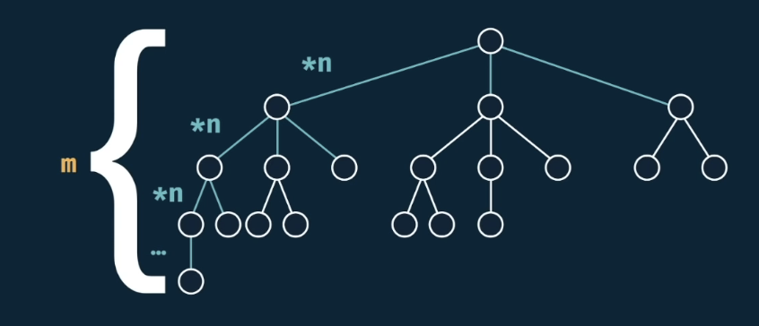

We've seen this pattern before were for example, if we have 3 numbers in the array, a node will have at most 3 child nodes, because we have 3 choices to take.

I have n levels, and from one level to the next, I would multiply the number of nodes by n. This is the same thing as saying, we take **n** and multiply it by itself **m** times.

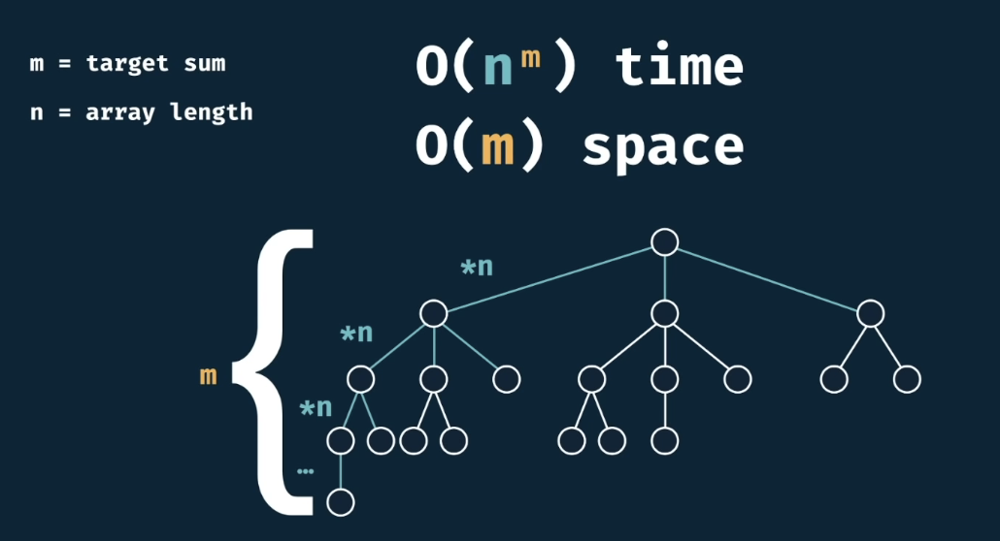

<h3>Complexity w memoization</h3>

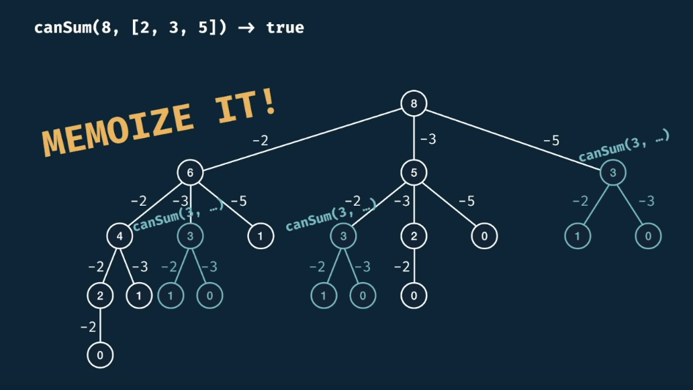

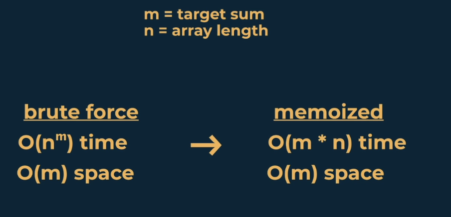