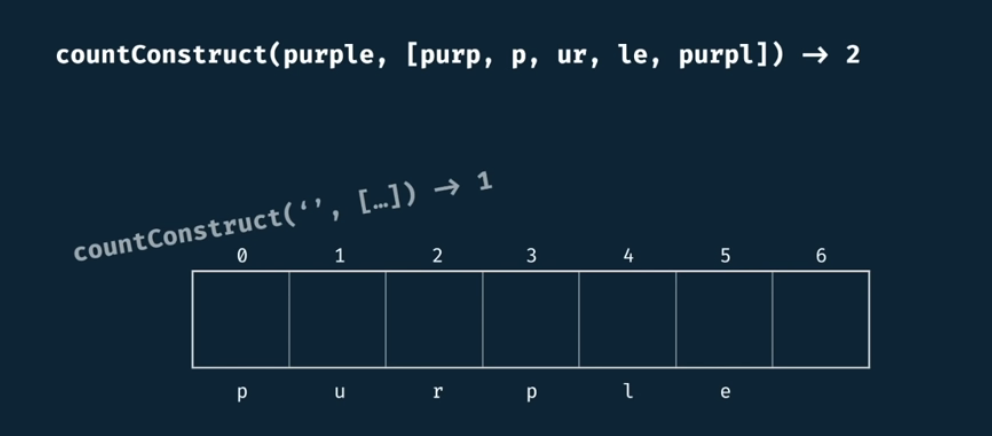

# Count Construct Tabulated

<h2>Description</h2>

Write a function ```countConstruct(target, wordBank)``` that accepts a target string and an array of strings.

The function should return the number of ways that the ```target``` can be constructed by concatenating elements of the ```worldBank``` array.

You may reuse elements of ```wordBank``` as many times as needed.

<h2>Example</h2>

```countConstruct(purple, [purp, p, ur, le, purpl]) -> 2```


Base case is:




Start all other slots at zero.


When we are at some position, we go up to but not including that.

So from any position, we should consider any other spot within the table. So, in index 0, we consider words that start with **p**.


This was the very first pass, now we move current position to the right.


Next spot, Nothing happens. We progress.


Now, we see that looking into index 4, we see a 2. We are considering a substring that starts at 0 up to but not including 4. If there's a 2, there's 2 ways to generate **purp**.


We could have taken **+le**. 


## Complexity

