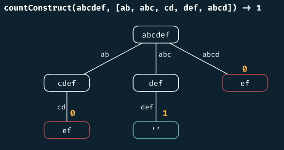
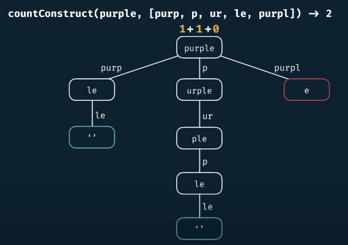
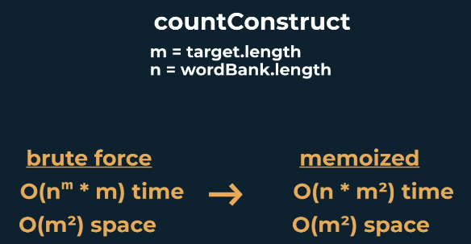

# Count Construct

<h2>Description</h2>

Write a function ```countConstruct(target, wordBank)``` that accepts a target string and an array of strings.

The function should return the number of ways that the ```target``` can be constructed by concatenating elements of the ```worldBank``` array.

You may reuse elements of ```wordBank``` as many times as needed.

<h2>Example</h2>



```countConstruct(purple, [purp, p, ur, le, purpl]) -> 2```



<h2>Complexity</h2>

