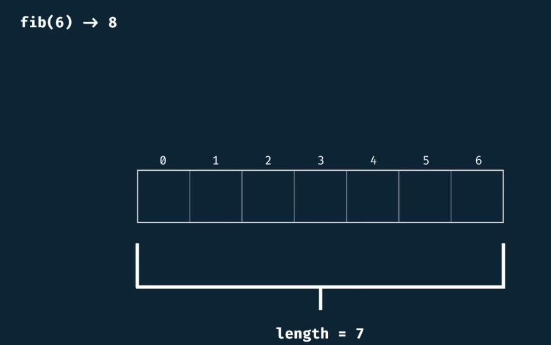
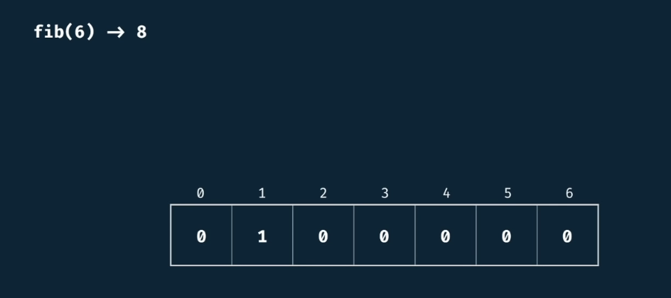
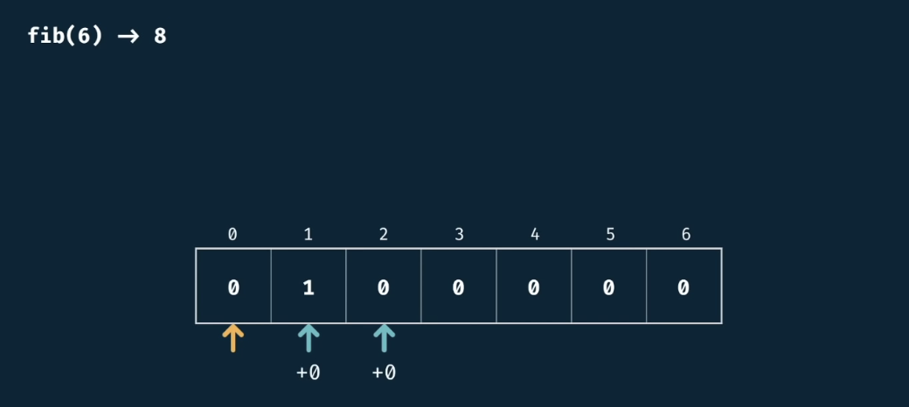
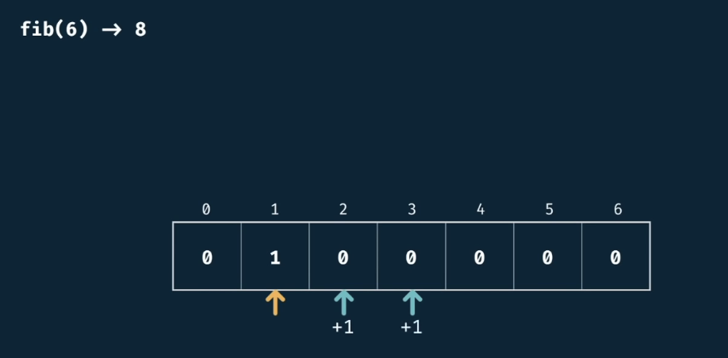
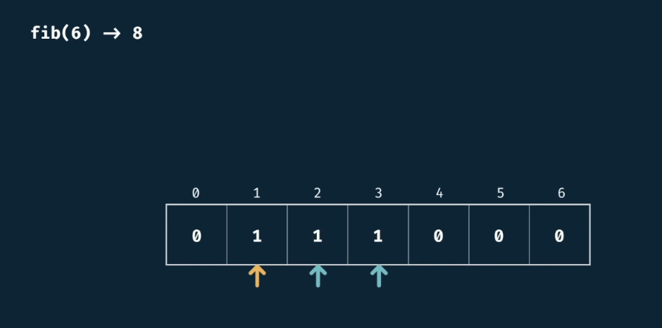
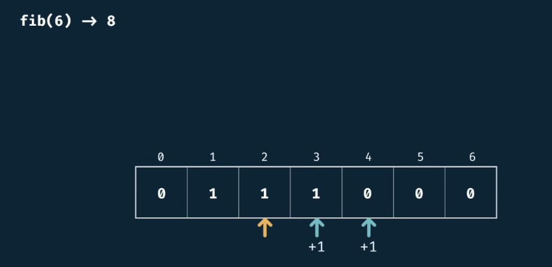
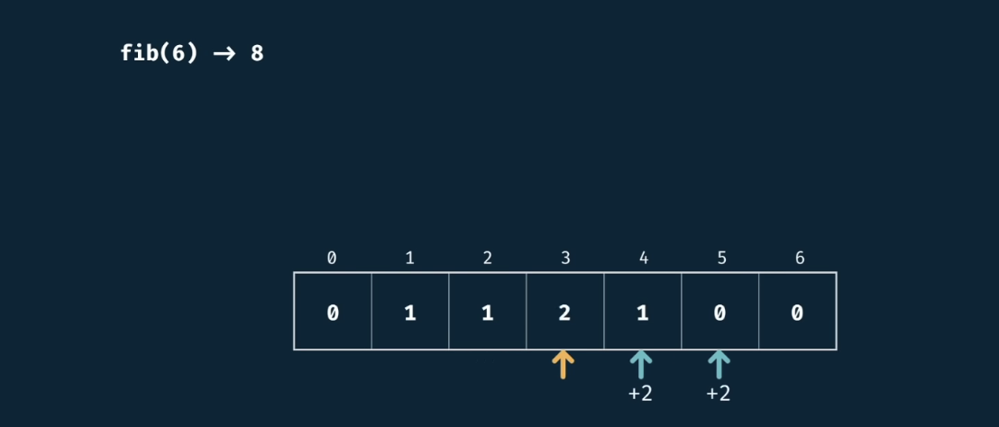
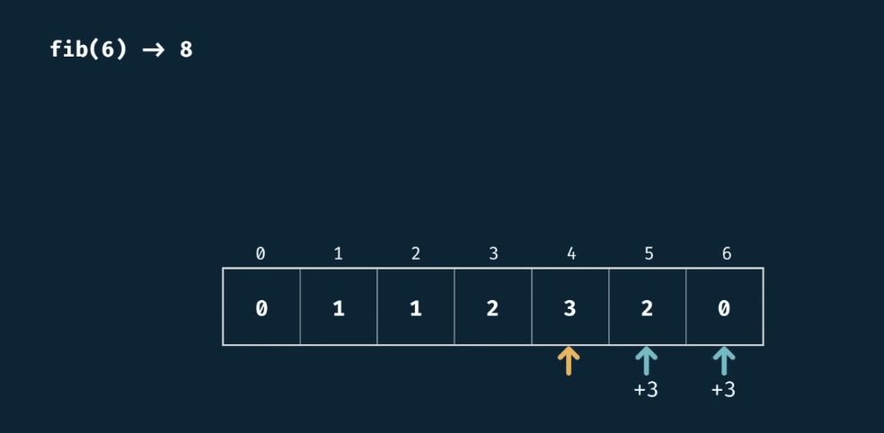
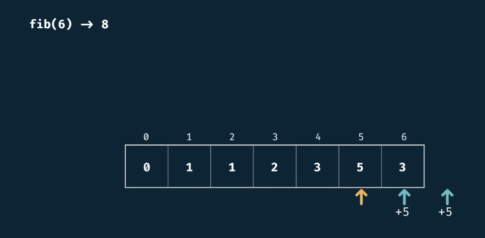
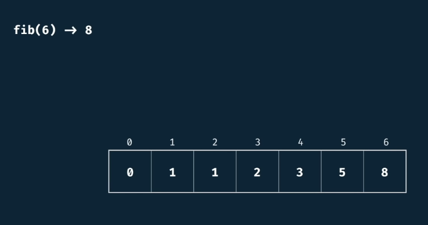

# Fibonacci

<h2>Description</h2>

Write a function fib(n) that takes in a number as an argument. 

The function should return the n-th number of the fibonacci sequence.

The 0th number of the sequence is 0.
The 1st number of the sequence is 1.

To generate the next number of the sequence, we sum the previous two.

<h2>Example</h2>

```fib(6) -> 8```

<h2>Tabulation</h2>

We solve it iteratively by building a table.

If the input is 6 we'll build an array of 6.



Initialize every position to zero. The fact that we know that fibonacci takes a sum, 0 is a great value to start a running sum.

If we see 0th position is zero. Which is good. Now 1st position is 1. 



So we add the 0th position with the next 2 positions. Because it is a zero it won't change

















<h2>Complexity</h2>

- Time complexity $O(n)$ because we just iterated feed forward.

- Space complexity $O(n)$.
