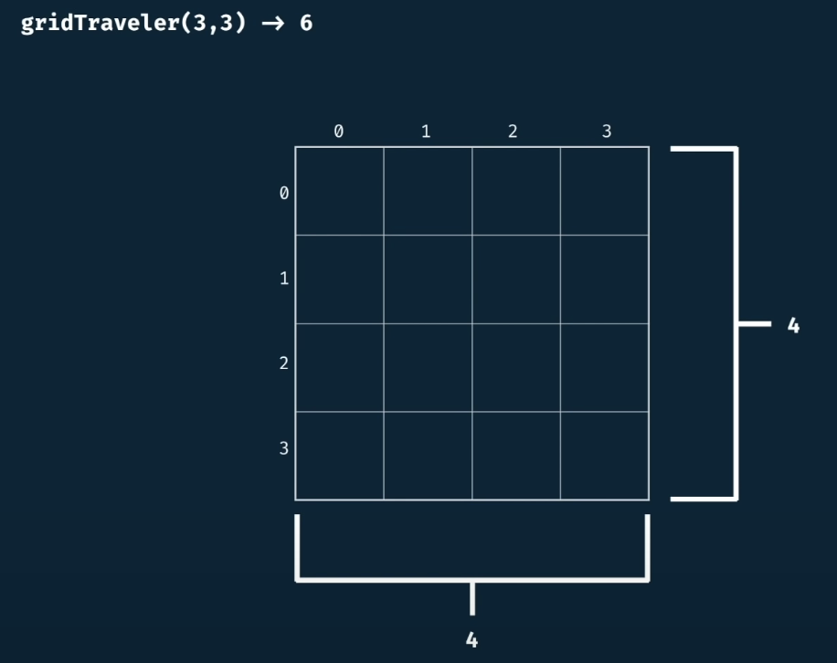
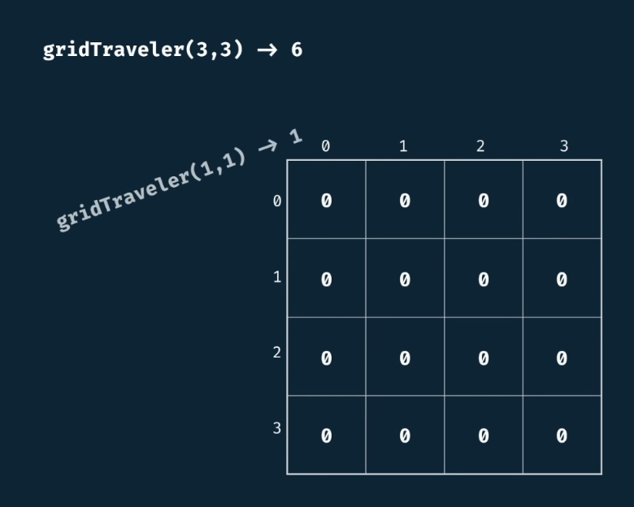
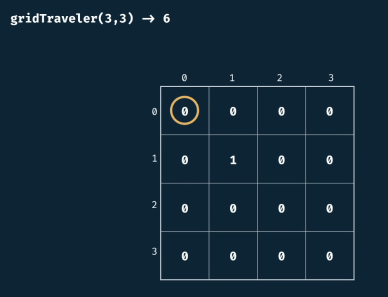
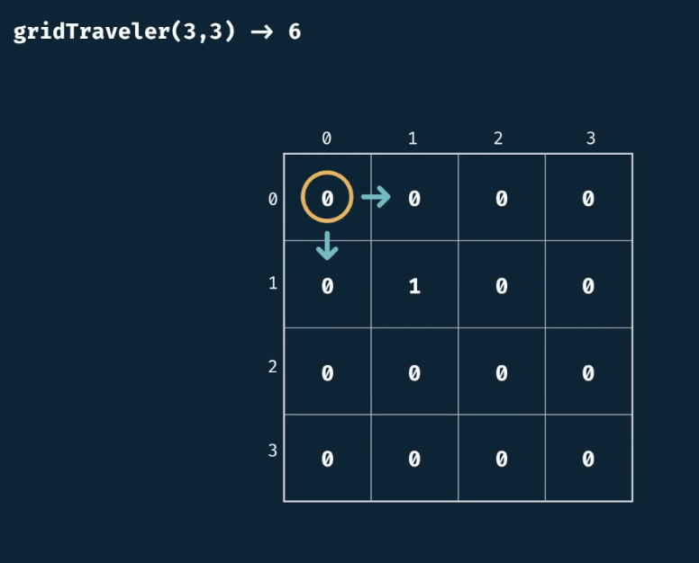
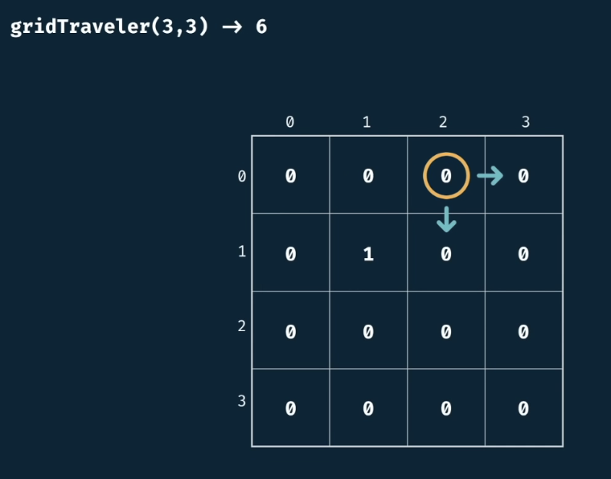
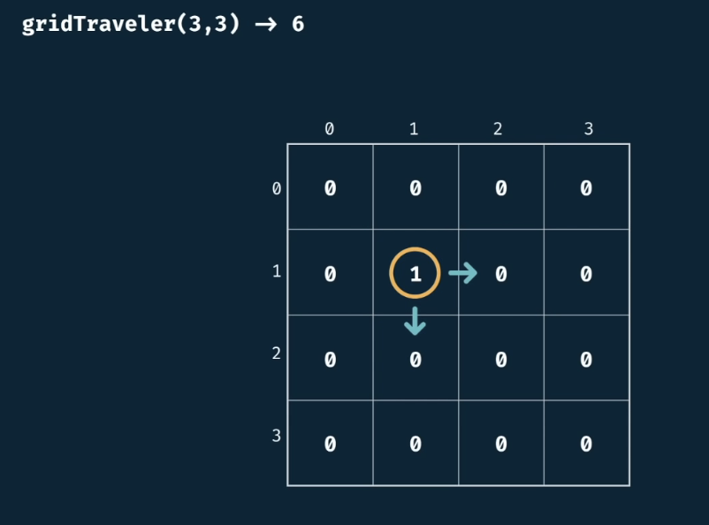
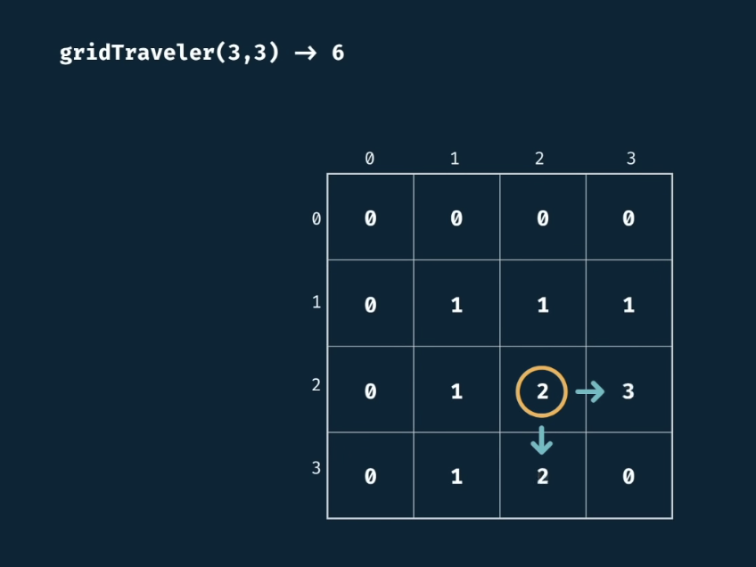
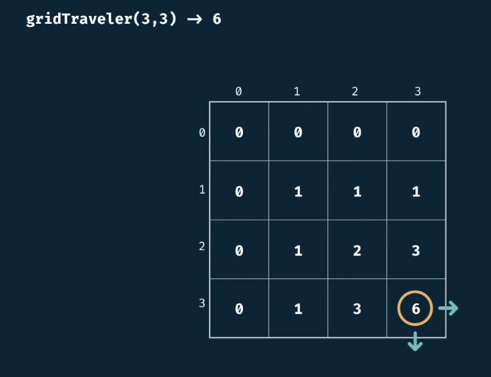

# Grid Traveler with Tabulation

## Description

Say that you are a traveler on a 2D grid. You begin in the top-left corner and your goal is to travel to the bottom-right corner. You may only move down or right.

*In **how many ways** can you travel to the goal on a grid with dimensions $m*n$.*

## Example

```gridTraveler(3,3) -> 6```

















## Complexity

- Time Complexity O(m*n)
- Space Complexity O(m*n)