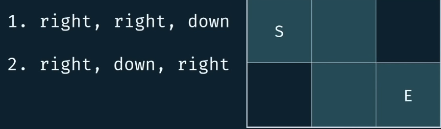

# Grid Traveler

<h2>Description</h2>

Say that you are a traveler on a 2D grid. You begin in the top-left corner and your goal is to travel to the bottom-right corner. You may only move down or right.

*In **how many ways** can you travel to the goal on a grid with dimensions $m*n$.*

Write a function ```gridTraveler(m,n)```

<h2>Example</h2>

```gridTraveler(2,3)```


Solutions:

1. 
2. 
3. 

Think of the easiest possible case:

```gridTraveler(1,1)```

The start is the same of the end. So we already have the solution, we don't have to do nothing.

Solutions.

1. 'Do nothing'

What about empty grid?

```gridTraveler(0,1)```
```gridTraveler(1,0)```
```gridTraveler(8,0)```
```gridTraveler(0,0)```

The solution is 0. *No grid to be traveled, **no way to travel**.*

**This are all base cases that will reconstruct to the general case.**

Now let's say we try to solve a (3,3) travel:

```gridTraveler(3,3)``` -> Go Down

```gridTraveler(2,3)``` -> Go Right

```gridTraveler(2,2)``` -> Go Down

```gridTraveler(1,2)``` -> Go Right

```gridTraveler(1,1)``` -> Base case !!! 

 <h3>Tree Recursive Visualization</h3>


Also, we know what combination of moves lead to a solution.


<h2>Complexity</h2>

Since we've two inputs, the time complexity will be calculated in terms of both parameters (m,n).

We know the base cases come when the parameters become (1,1) or any of both become (0).

To reach this base case we can substract -1 from each parameter so we have:

### Brute Forced


### Memoized


<h2>Memoization</h2>

Identify duplicate sub-problems.


<h2>References</h2>

[youtube](https://www.youtube.com/watch?v=oBt53YbR9Kk&t=10364s)

<h2>Notes</h2>

Try to think of the problem as a tree.