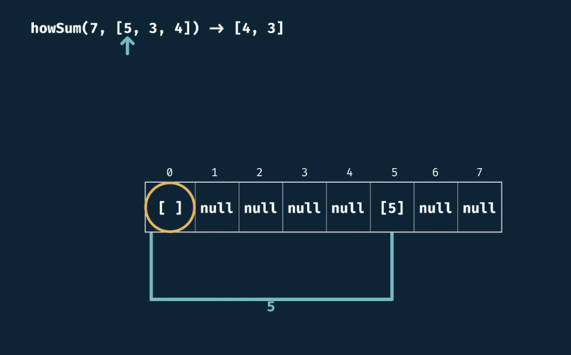
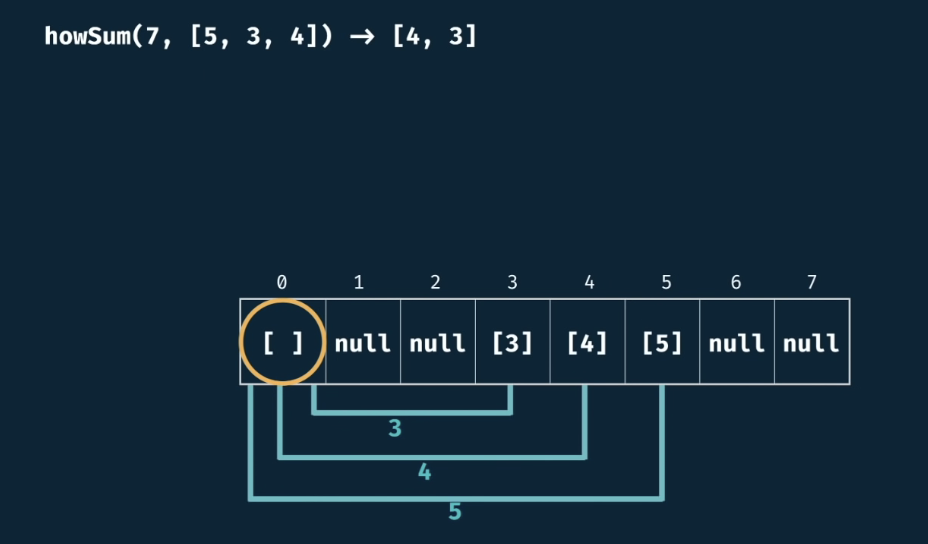

# How Sum Tabulated

## Description

Write a function ```howSum(targetSum, numbers)``` that takes in a targetSum and an array of numbers as arguments.

The function should return an array containing any combination of elements that add up to exactly the targetSum. If there is no combination that adds up to the targetSum then return null.

If there are multiple combinations possible, you may return any single one.

## Example

```howSum(7, [5,3,4]) -> [4,3]```


We start by tagging the base case.








## Complexity

