# How Sum

<h2>Description</h2>

Write a function ```howSum(targetSum, numbers)``` that takes in a targetSum and an array of numbers as arguments.

The function should return an array containing any combination of elements that add up to exactly the targetSum. If there is no combination that adds up to the targetSum then return null.

If there are multiple combination possible, you may return any single one.

<h2>Example</h2>

```howSum(7, [5,3,4,7]) -> [7]```
```howSum(7, [2,3,4,7]) -> [2,2,2,2]```
```howSum(8, [2,3,5,7]) -> [3,5]```
```howSum(7, [2,4]) -> null```
```howSum(0, [1,2,3]) -> []```

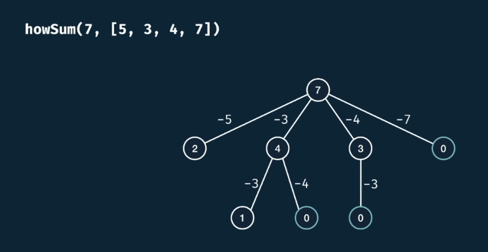

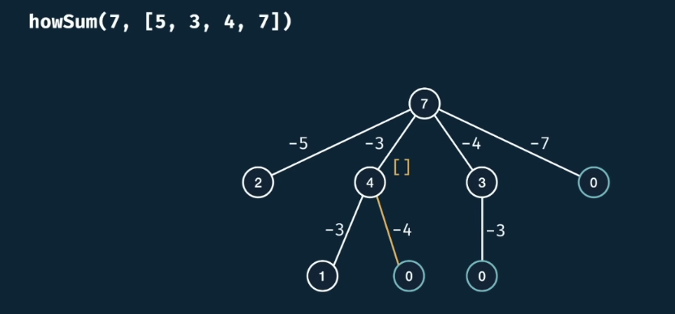

Add the current choice actually.

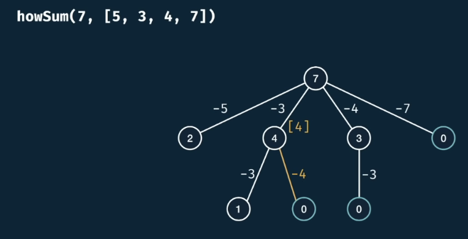

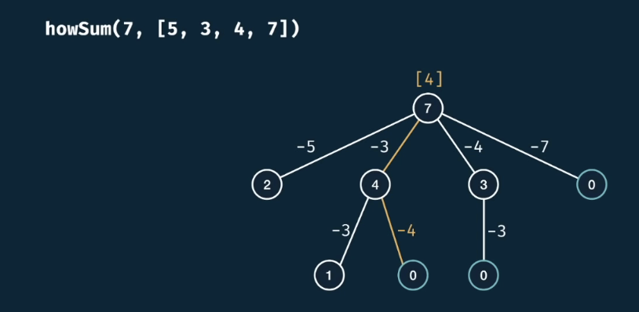

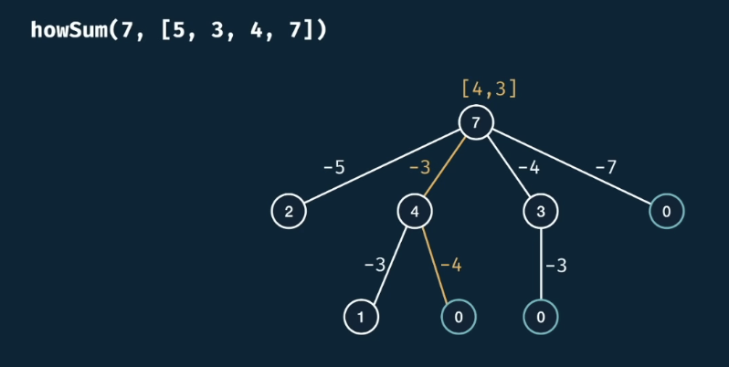

Or, the far right case.

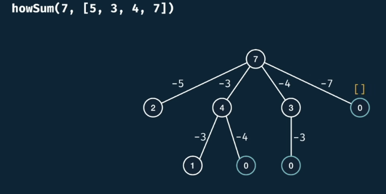

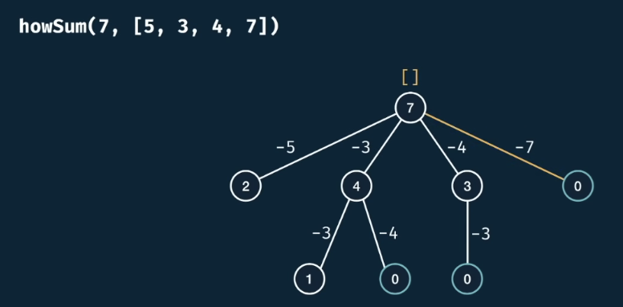

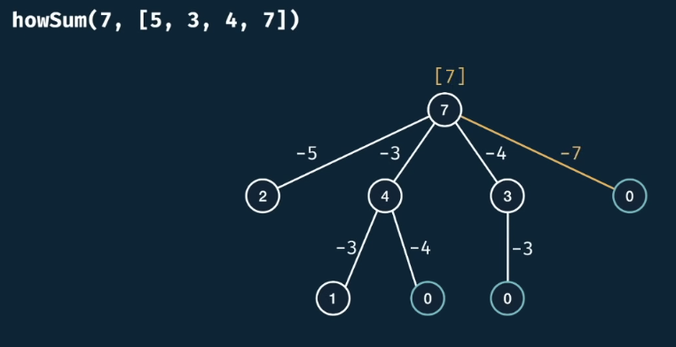

But, let's consider this base cases we hit:

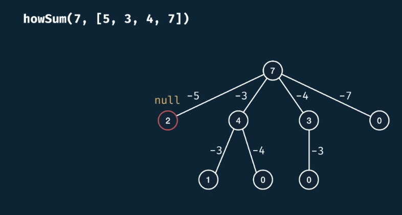

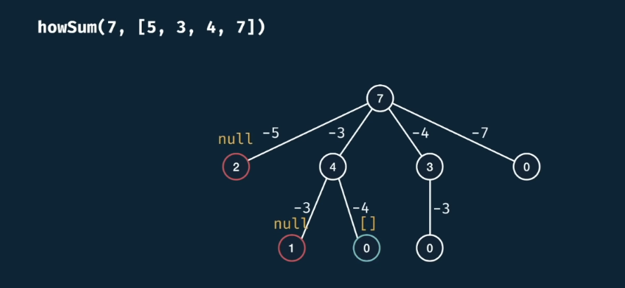

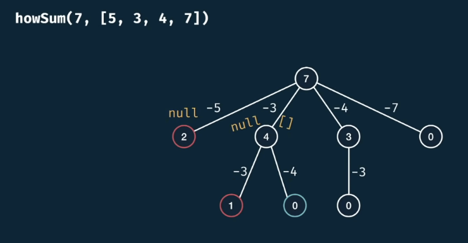

Here, the array of 4 wins out the null. Because we know that there's a way to generate a 4.

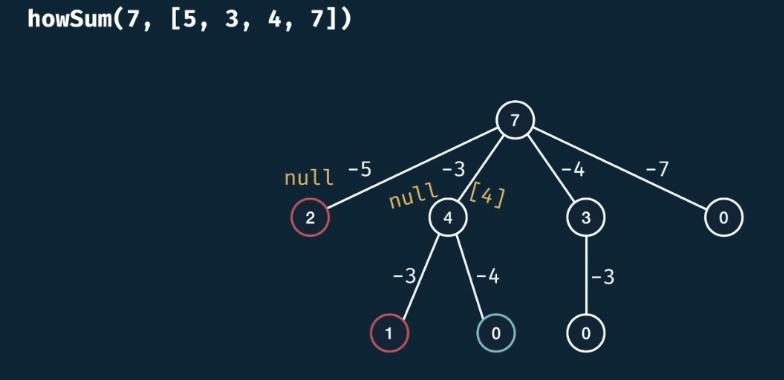

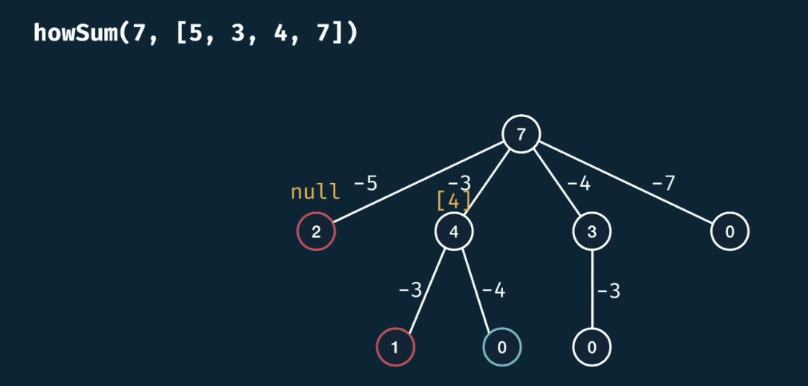

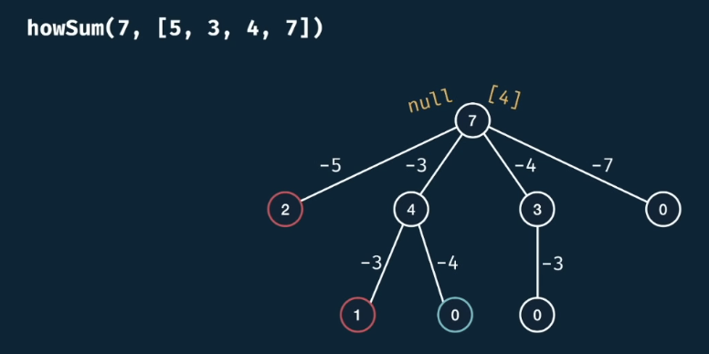

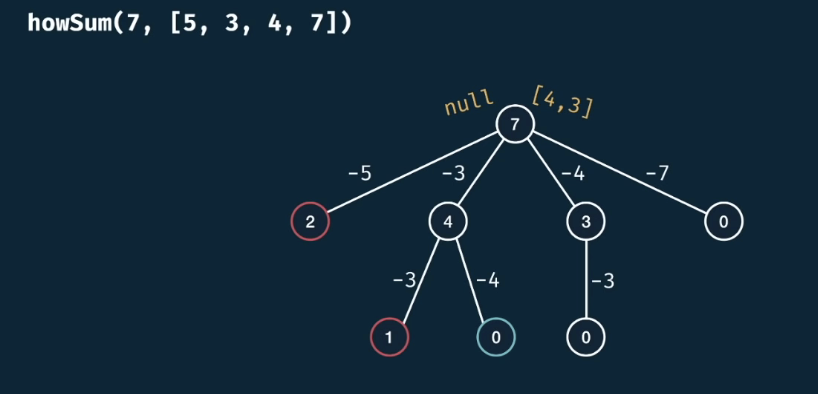

Here, we are happy with at least one solution.

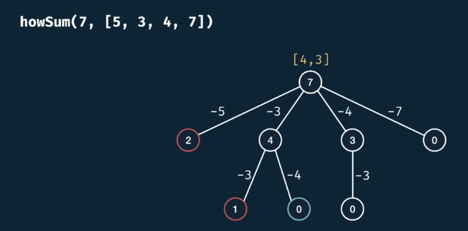

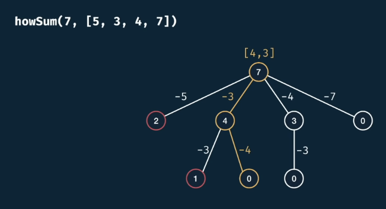

<h2>Complexity</h2>

<h3>w/o Memoization</h3>

Given that **m** is the target sum and **n** is numbers.length

- Time Complexity: $O(n^m * m)$, second multiplication by m comes from the spread operation

- Space Complexity: $O(m)$

<h3>w Memoization</h3>

- Time Complexity: $O(n * m * m)$ $=$ $O(n * m^2)$ 

- Space Complexity: $O(m * m)$ $=$ $O(m^2)$

*Recall that $m^2$ is not exponential, this is due to the fact that the exponent is a constant, not a variable.*

*Wheres $n^m$ is indeed exponential.*

*There's a tradeoff here, where memoized version uses polynomial space complexity*