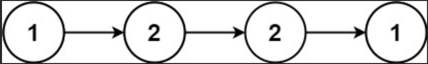
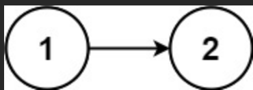

# Palindrome Linked List

Given the head of a singly linked list, return true if it is a palindrome or false otherwise.

Example:

Input: head = [1,2,2,1]

Output: true

Example 2:

Input: head = [1,2]

Output: false

<h3>Constraints:</h3>

- The number of nodes in the list is in the range [1, 105].
- 0 <= Node.val <= 9

Follow up: Could you do it in O(n) time and O(1) space?